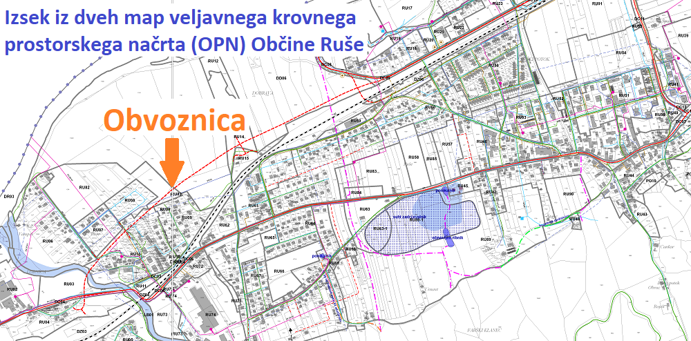

### Zaušnica samovšečnosti in arogantnosti?

#### Zaskrbljeni krajani Smolnika in Ruš
#### Ad Hoc Civilna Iniciativa

# Izjava za javnost - Zaušnica samovšečnosti in arogantnosti?

Ta teden smo imeli vsi skupaj priliko opazovati manevre županje Ruš ge. Urške Repolusk, 
ko se ji je najprej v zapisnik 20. redne seje Občinskega sveta Občine Ruše prikradla 
tipkarska napaka pri zelo pomembnem sklepu. Nato smo videli materiale za 10. točko 
dnevnega reda 21. redne seje, v katerih je operirala s številkami pobud, ki pa jih 
vsebinsko ni priložila in obrazložila. Nazadnje pa je dan pred sejo objavila še serijo 
kontradiktornih sklepov na temo zahodnega dela obvoznice Ruše.

Danes se je odvijala 21. redna seja Občinskega sveta Občine Ruše, kjer so svetniki 
ge. županji Urški Repolusk **ponudili priliko, da** v točki 10. **izvzame materiale in 
sklepe**, ki **so presegali vsebinski obseg te točke**. Za to se ga. županja Urška Repolusk 
ni odločila. Svetniki pa posledično niso imeli druge možnosti, kot da ne sprejmejo 
dnevnega reda seje. Seje brez dnevnega reda ni bilo mogoče nadaljevati.

**Ga. županja Urška Repolusk je s svojim neodgovornim ravnanjem povzročila propad seje 
Občinskega sveta Občine Ruše, ki jo je sama sklicala.**

**Svetnikom Občinskega sveta Občine Ruše pa velja izkazati vso spoštovanje, ker so 
vztrajali pri svoji prvotni odločitvi in niso pustili uveljavljaviti samovoljne 
odločitve za premikanje trase ceste v naši občini.**

Na žalost naša opozorila, ki smo jih večkrat izrekli tudi v zelo lahko berljivi obliki 
nimajo nikakršnega učinka na županjo go. Urško Repolusk.

Zato bomo še enkrat ponovili dejstva:

1. **V Rušah smo že izbrali traso za zahodni del obvoznice Ruše!**   
Za to traso je že izvedena in revidirana primerjava variant, ter na podlagi 
opravljene recenzije že izbrana varianta, katere os trase je že vključena v 
krovni prostorski načrt (OPN). Na dveh priloženih slikah, ki sta izseka 
načrtov veljavnega krovnega prostorskega načrta Občine Ruše (OPN) je trasa 
tudi lepo vidna.
 
 

Slika je izsek načrta iz veljavnih prostorskih aktov občine Ruše. Označili smo traso.
 
 
	

Slika je izsek dveh načrtov iz veljavnih prostorskih aktov občine Ruše (OPN).
Označili smo traso.
 
 
	
2. Svetniki Občinskega sveta Občine Ruše so s sprejetjem sklepa na 20. redni seji 
Občinskega sveta, ki se pomensko glasi:    
**“OSOR prepoveduje vse nadaljne postopke ....**   
**v zvezi z <u>novo</u> traso Ruške obvoznice. ....”**    
ge. županji Urški Repolusk dali nedvoumno in jasno sporočilo, da **ne želijo, da se 
občinska uprava z novo (prestavljeno) traso zahodnega dela obviznice še naprej 
ukvarja in zapravlja denar.**

3. Ob tako jasni formulaciji zgoraj navedenega sklepa iz 20. redne seje ni 
potrebe po sprejemanju dodatnih sklepov. Stara trasa je že vnešena v veljavni 
krovni prostorski načrt (OPN) Občine Ruše.

Za nadaljevanje dela, je potrebno razveljaviti “Sklep o spremembah in dopolnitvah 
sklepa o začetku postopka priprave občinskega podrobnega prostorskega načrta (OPPN) 
za obvoznico Ruše – faza 1”, z dne 19. maja 2020, objavljen v Uradnem glasilu 
slovenskih občin št. 28/29.5.2020. Sklep je bil podlaga za pričetek uradnih 
aktivnosti prestavitve lokacije trase zahodne obvoznice.

Nato je potrebno sprejeti nov sklep v prvotnem besedilu, kot se je glasil sklep 
z dne 12. septembra 2017. S tem bi vrnili obstoječo traso zahodne obvoznice v plan 
izgradnje.

Za nadaljevanje dela na stari trasi obvoznice ni potrebno spreminjati veljavnega 
krovnega prostorskega načrta (OPN), ki ga lahko vsak pogleda na sledeči povezavi:
[Veljavni prostorski akti Občine Ruše](https://dokumenti-pis.mop.gov.si/javno/veljavni/O108I/index.html)

 
	
Spoštovana ga. županja Urška Repolusk!

## Tokrat ne rabite zlivati gnojnice na druge, ker ste imeli sami v rokah škarje in platno!

Moramo pa povedati, da nas je te dni spreletel srh, ko smo zasledili, da oseba na 
najvišji funkciji v naši občini citira izrek vojnega zločinca.
   
Ruše, 14. april 2022   
V imenu civilne iniciative 

Jasmina Vrečko Rupnik, Gregor Vrečko

 
	
[Kazalo](index-izjave-za-javnost.md)

