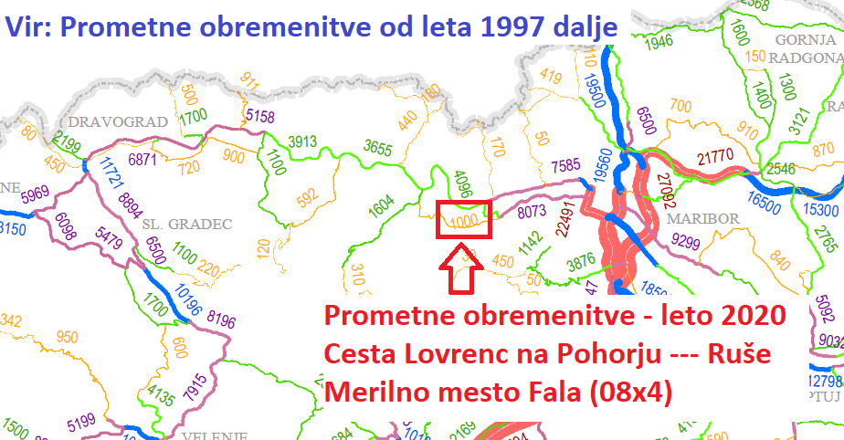
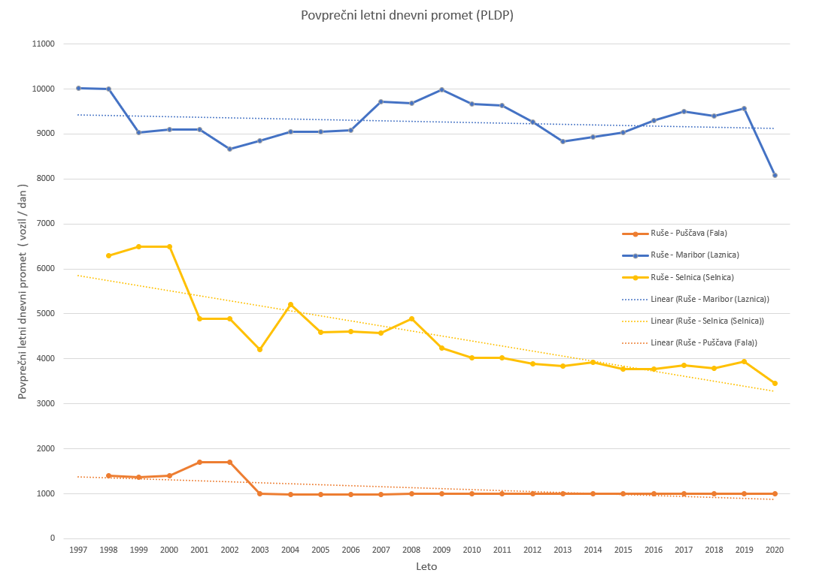

### Zakaj se županja tako boji prometa mimo njene hiše?

#### Zaskrbljeni krajani Smolnika in Ruš
#### Ad Hoc Civilna Iniciativa

# Izjava za javnost - Zakaj se županja tako boji prometa mimo njene hiše?

Danes smo preverili koliko je dejansko prometa na relaciji Lovrenc na Pohorju - Ruše.
Za primerjavo smo naredili grafe še za smer Ruše - Maribor in Ruše - Selnica.

Kot pokažejo rezultati meritev prometa je na relaciji Ruše - Puščava - Lovrenc
na Pohorju zelo malo prometa napram drugima dvema smerema. 
**Zaradi tega smo že večkrat povedali, da obvoznica ni najbolj prikladno ime za to cesto**, 
saj količina prometa najbrž ne zadosti kriteriju
za obvoznico. **To bi lahko bila lepa krajevna cesta, s širokim
cestiščem, dvema pločnikoma, kolesarsko stezo in drevoredom**. Rušani bi lahko bili 
zelo **ponosni** na njo. 

Nikakor pa ne bi bili ponosni na **bob stezo**, ki jo planira županja Ruš namesto
obstoječe 30 let stare trase zahodnega dela obvoznice Ruše. Ob železnico bi umestila 
ozko cesto z ozkim hodnikom za pešce in to stanovalcem meter pred okna. Če upoštevamo 
še protihrupni zid, ki bi ga zgradili tik ob oknih bi se stanovalci na tej 
lokaciji počutili kot v zaporu.
**To je ge. županji Ruš Urški Repolusk seveda čisto vseeno, saj nas doslej še ni 
uradno obvestila, da Občina prestavlja 30 let staro traso ceste mimo naših oken**.
Še več, kljub temu, da sedaj že vemo, da županja premika traso sama še naprej stoji 
na stališču, da krajani še nismo upravičeni izvedeti resnice, saj postopek, ki ga
vodi občinska uprava to v tem trenutku menda še ne predvideva.

**Ob pogledu na številke nam pa sploh ni jasno, zakaj županjo Ruš ta trasa tako zelo moti**.
Na cesti iz Lovrenca na Pohorju pelje **1000 vozil na dan**, kar pomeni približno **42 
avtomobilov na uro** oziroma **0,7 avtomobila na minuto**. **Ves ta promet pa se prepolovi na dve cesti**.
Na Falsko cesto in na planiran odsek zahodnega dela obvoznice.

Na spletu si lahko vsak pogleda podatke 
[Prometnih obremenitev od leta 1997 dalje](https://podatki.gov.si/dataset/pldp-karte-prometnih-obremenitev).

Na zemljevidu prometnih obremenitev za leto 2020 je lepo prikazana obremenitev
ceste Lovrenc na Pohorju - Ruše. Na merilnem mestu Fala je vidno, da se
dnevno v povprečju po tej cesti pelje **1000 vozil**.

 

**Slika**: Prometne obremenitve v Sloveniji za leto 2020.

 
	

Na spodnji sliki smo grafično prikazali podatke za tri smeri iz Ruš:

1. Smer **Ruše - Maribor** (Merilno mesto Laznica) - Modra barva.
2. Smer **Ruše - Selnica** (Merilno mesto Selnica) - Rumena barva.
3. Smer **Ruše - Puščava** (Merilno mesto Fala) - Oranžna barva.

Trendi so označeni s pikčasto linijo iste barve.

 

**Slika**: Povprečni letni dnevni promet za tri smeri iz Ruš.
  

## Naše laične ugotovitve

### Promet na relaciji Ruše - Maribor 

Promet na relaciji Ruše - Maribor je **8 krat** do **10 krat** **večji** kot je promet na relaciji
Lovrenc na Pohorju - Ruše.

Promet na relaciji Ruše - Maribor je **2 krat** do **2,5 krat** **večji**, kot je promet
čez most na Dravi proti Selnici.

### Promet na vseh treh smereh je v rahlem upadanju

Trend prometa v vseh treh smereh je v rahlem upadanju. Več ali manj je
dokaj podoben od leta 1997 do leta 2020.

### Promet iz smeri Lovrenca na Pohorju je minimalen

Promet iz smeri Lovrenca na Pohorju je cca 1000 avtomobilov / dan.
Pri tem je potrebno povedati, da je bilo to izmerjeno nazadnje leta 2008. 
Glede na to, da so meritve v drugih dveh smereh pokazale konstanten promet 
je najbrž to tudi dokaj dejanska številka za smer iz Lovrenca na Pohorju.

Če preračunamo 1000 avtomobilov na dan, ki se peljejo na tej relaciji:

- 1000 avtomobilov / dan
- 42 avtomobila / uro
- 0,7 avtomobila / minuto

## Tabelarični prikaz dnevnega števila vozil

Vsi podatki so povprečno letno število vozil na dan (PLDP - Povprečni Letni Dnevni Promet).
Tovorna vozila so kategorizirana po teži:

- Skupaj   - Skupni promet
- Mot.     - Motorji
- Osebna   - Osebna vozila
- L.tov.   - Lahka tovorna vozila (< 3,5t)
- S.tov.   - Srednja tovorna vozila (3,5t - 7t)
- T.tov.   - Težka tovorna vozila (nad 7t)
- T.prik.  - Tovorno vozilo s prikolico

**Vsi podatki so prepisani iz tabel, ki jih je objavilo Ministrstvo za Infrastrukturo,
Direkcija Republike Slovenije za infrastrukturo** na naslednji povezavi:
[Prometne obremeniteve od leta 1997 dalje](https://podatki.gov.si/dataset/pldp-karte-prometnih-obremenitev).

### Ruše --- Puščava   (Merilno mesto Fala)										

| Leto | Skupaj  |	Mot.  	|  Osebna | Avtobus | L.tov.   | S.tov.  | T.tov.   |	T.prik.	  | Vlačilci |
| ---: | ------: | -------: | ------: | ------: | -------: | ------: | -------: | --------: | -------: |
| 2020 |  1000   |  9       | 908     |  12     |   44     |   13    |  6       |   3       |   5      |  
| 2019 |  1000   |  9       | 908     |  12     |   44     |   13    |  6       |   3       |   5      | 
| 2018 |  1000   |  9       | 908     |  12     |   44     |   13    |  6       |   3       |   5      | 
| 2017 |  1000   |  9       | 908     |  12     |   44     |   13    |  6       |   3       |   5      | 
| 2016 |  1000   |  9       | 908     |  12     |   44     |   13    |  6       |   3       |   5      | 
| 2015 |  1000   |  9       | 908     |  12     |   44     |   13    |  6       |   3       |   5      | 
| 2014 |  1000   |  9       | 908     |  12     |   44     |   13    |  6       |   3       |   5      | 
| 2013 |  1000   |  9       | 908     |  12     |   44     |   13    |  6       |   3       |   5      | 
| 2012 |  1000   |  9       | 908     |  12     |   44     |   13    |  6       |   3       |   5      | 
| 2011 |  1000   |  9       | 908     |  12     |   44     |   13    |  6       |   3       |   5      | 
| 2010 |  1000   |  9       | 908     |  12     |   44     |   13    |  6       |   3       |   5      | 
| 2009 |  1000   |  9       | 908     |  12     |   44     |   13    |  6       |   3       |   5      | 
| 2008 |  997    |  9       | 905     |  12     |   44     |   13    |  6       |   3       |   5      | 
| 2007 |  980    |  1       | 910     |  10     |   40     |   9     |  5       |   5       |          | 
| 2006 |  980    |  1       | 910     |  10     |   40     |   9     |  5       |   5       |          | 
| 2005 |  980    |  1       | 910     |  10     |   40     |   9     |  5       |   5       |          | 
| 2004 |  980    |  1       | 913     |  10     |   37     |   9     |  5       |   5       |          | 
| 2003 |  1000   |  3       | 946     |  10     |   30     |   5     |  3       |   3       |          | 
| 2002 |  1700   |  3       | 1591    |  17     |   49     |   19    |  10      |   11      |          | 
| 2001 |  1700   |  3       | 1591    |  17     |   49     |   19    |  10      |   11      |          | 
| 2000 |  1400   |  3       | 1310    |  14     |   40     |   16    |  8       |   9       |          | 
| 1999 |  1372   |  3       | 1283    |  14     |   39     |   16    |  8       |   9       |          | 
| 1998 |  1400   |  0       | 1295    |  20     |   33     |   19    |  14      |   19      |          | 

### Ruše --- Selnica   (Merilno mesto Selnica)										

| Leto | Skupaj  |	Motorji	|  Osebna | Avtobus | L.tov.   | S.tov.  | T.tov.   |	T.prik.	  | Vlačilci |
| ---: | ------: | -------: | ------: | ------: | -------: | ------: | -------: | --------: | -------: |
| 2020 | 3463    |   33     |  2955   |  10     |  245     |  40     |  87      |   14      |   79     |  
| 2019 | 3941    |   35     |  3461   |  18     |  249     |  41     |  81      |   12      |   44     | 
| 2018 | 3789    |   35     |  3330   |  19     |  244     |  40     |  61      |   12      |   48     | 
| 2017 | 3856    |   39     |  3347   |  24     |  246     |  55     |  100     |   8       |   37     | 
| 2016 | 3779    |   38     |  3345   |  25     |  206     |  75     |  63      |   8       |   19     | 
| 2015 | 3773    |   44     |  3305   |  16     |  204     |  89     |  74      |   12      |   29     | 
| 2014 | 3917    |   40     |  3432   |  13     |  212     |  93     |  77      |   15      |   35     | 
| 2013 | 3843    |   42     |  3393   |  9      |  210     |  84     |  69      |   11      |   25     | 
| 2012 | 3894    |   44     |  3482   |  8      |  216     |  68     |  56      |   6       |   14     | 
| 2011 | 4020    |   41     |  3589   |  6      |  223     |  76     |  62      |   7       |   16     | 
| 2010 | 4018    |   40     |  3592   |  14     |  223     |  71     |  58      |   6       |   14     | 
| 2009 | 4242    |   51     |  3786   |  14     |  235     |  75     |  61      |   6       |   14     | 
| 2008 | 4884    |   54     |  4383   |  17     |  191     |  135    |  68      |   19      |   17     | 
| 2007 | 4573    |   47     |  4077   |  14     |  178     |  136    |  69      |   52      |          | 
| 2006 | 4612    |   54     |  4020   |  15     |  289     |  97     |  86      |   51      |          | 
| 2005 | 4591    |   48     |  3999   |  14     |  288     |  103    |  91      |   48      |          | 
| 2004 | 5206    |   27     |  4710   |  23     |  226     |  84     |  94      |   42      |          | 
| 2003 | 4200    |   20     |  3869   |  19     |  202     |  40     |  30      |   20      |          | 
| 2002 | 4895    |   15     |  4419   |  19     |  202     |  142    |  50      |   48      |          | 
| 2001 | 4893    |   15     |  4417   |  19     |  202     |  142    |  50      |   48      |          | 
| 2000 | 6500    |   29     |  5864   |  36     |  249     |  137    |  111     |   74      |          | 
| 1999 | 6500    |   29     |  5864   |  36     |  249     |  137    |  111     |   74      |          | 
| 1998 | 6300    |   28     |  5683   |  35     |  241     |  133    |  108     |   72      |          | 
                                                     
### Ruše --- Maribor   (Merilno mesto Laznica)										                                                            

| Leto | Skupaj  |	Motorji	|  Osebna | Avtobus | L.tov.   | S.tov.  | T.tov.   |	T.prik.	  | Vlačilci |         
| ---: | ------: | -------: | ------: | ------: | -------: | ------: | -------: | --------: | -------: |         
| 2020 | 8073    |  77      | 7194   |    31    |   521    |  67     |  95      |  18       |   70     |         
| 2019 | 9560    |  79      | 8670   |    42    |   536    |  63     |  92      |  17       |   61     |         
| 2018 | 9404    |  78      | 8537   |    44    |   534    |  63     |  75      |  16       |   57     |         
| 2017 | 9499    |  73      | 8622   |    44    |   544    |  72     |  68      |  20       |   56     |         
| 2016 | 9304    |  68      | 8436   |    42    |   545    |  70     |  64      |  20       |   59     |         
| 2015 | 9025    |  77      | 8190   |    41    |   510    |  67     |  66      |  20       |   54     |         
| 2014 | 8924    |  70      | 8091   |    40    |   510    |  70     |  67      |  24       |   52     |         
| 2013 | 8835    |  57      | 8005   |    43    |   486    |  60     |  82      |  34       |   68     |      
| 2012 | 9266    |  65      | 8424   |    41    |   504    |  70     |  75      |  29       |   58     |      
| 2011 | 9627    |  63      | 8752   |    43    |   535    |  80     |  75      |  25       |   54     |      
| 2010 | 9660    |  57      | 8791   |    45    |   518    |  92     |  87      |  19       |   51     |      
| 2009 | 9980    |  67      | 9071   |    47    |   562    |  96     |  78      |  19       |   40     |      
| 2008 | 9684    |  5       | 8827   |    43    |   586    |  97     |  72      |  16       |   38     |      
| 2007 | 9710    |  37      | 8911   |    60    |   390    |  152    |  77      |  83       |          |         
| 2006 | 9090    |  35      | 8352   |    56    |   365    |  138    |  69      |  75       |          |         
| 2005 | 9052    |  35      | 8366   |    56    |   366    |  112    |  56      |  61       |          |         
| 2004 | 9050    |  35      | 8342   |    56    |   365    |  123    |  62      |  67       |          |         
| 2003 | 8850    |  36      | 8167   |    55    |   349    |  121    |  59      |  63       |          |         
| 2002 | 8667    |  19      | 7965   |    69    |   288    |  161    |  81      |  84       |          |         
| 2001 | 9100    |  20      | 8326   |    72    |   301    |  188    |  95      |  98       |          |         
| 2000 | 9100    |  20      | 8326   |    72    |   301    |  188    |  95      |  98       |          |         
| 1999 | 9025    |  20      | 8258   |    71    |   299    |  186    |  94      |  97       |          |         
| 1998 | 10000   |  34      | 8783   |    114   |   399    |  351    |  148     |  171      |          |         
| 1997 | 10020   |  34      | 8801   |    114   |   400    |  352    |  148     |  171      |          |

### Primerjava skupnega prometa na vseh treh smereh

| Leto |	Maribor |	Selnica	|  Fala   |
| ---: | ------: | -------: | ------: |
| 2020 | 8073    |   3463   | 1000    | 
| 2019 | 9560    |   3941   | 1000    | 
| 2018 | 9404    |   3789   | 1000    | 
| 2017 | 9499    |   3856   | 1000    | 
| 2016 | 9304    |   3779   | 1000    | 
| 2015 | 9025    |   3773   | 1000    | 
| 2014 | 8924    |   3917   | 1000    | 
| 2013 | 8835    |   3843   | 1000    | 
| 2012 | 9266    |   3894   | 1000    | 
| 2011 | 9627    |   4020   | 1000    | 
| 2010 | 9660    |   4018   | 1000    | 
| 2009 | 9980    |   4242   | 1000    | 
| 2008 | 9684    |   4884   | 997     | 
| 2007 | 9710    |   4573   | 980     | 
| 2006 | 9090    |   4612   | 980     | 
| 2005 | 9052    |   4591   | 980     | 
| 2004 | 9050    |   5206   | 980     | 
| 2003 | 8850    |   4200   | 1000    | 
| 2002 | 8667    |   4895   | 1700    | 
| 2001 | 9100    |   4893   | 1700    | 
| 2000 | 9100    |   6500   | 1400    | 
| 1999 | 9025    |   6500   | 1372    | 
| 1998 | 10000   |   6300   | 1400    | 
| 1997 | 10020   |          |         | 
   
  
	   
## In zakaj se torej županja ga. Urška Repolusk boji tega prometa?

## Nam to nikakor ni jasno!

  
Ruše, 19. april 2022   
V imenu civilne iniciative  
Jasmina Vrečko Rupnik, Gregor Vrečko

 
	
[Kazalo](index-izjave-za-javnost.md)

                                    