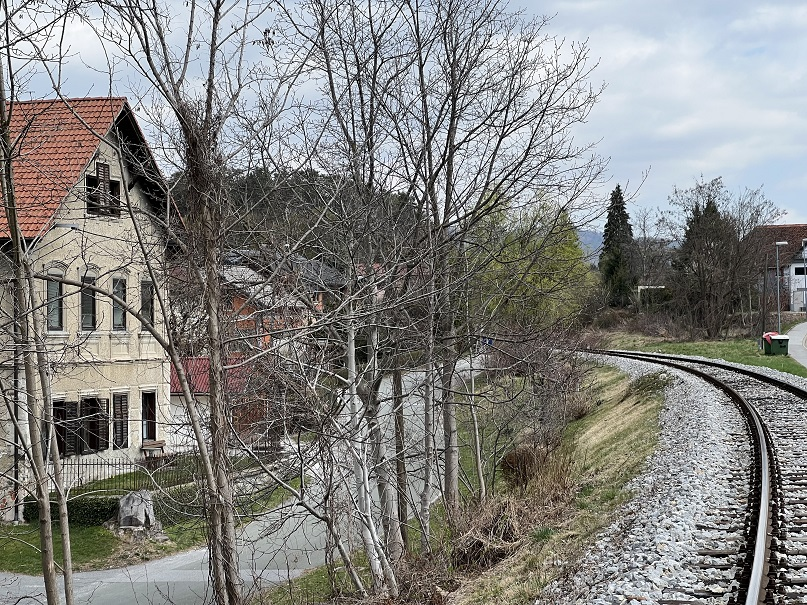

### Županja pod velikim pritiskom

#### Zaskrbljeni krajani Smolnika in Ruš
#### Ad Hoc Civilna Iniciativa

# Izjava za javnost - Županja pod velikim pritiskom

Spoštovani svetniki Občinskega sveta Občine Ruše!

Ga. županja Urška Repolusk nas iz tedna v teden bolj preseneča. 
Nazadnje vam svetnikom pošilja po kapljicah dokumente, ki so 
tako zelo transparentno (niso!) objavljeni na spletni strani 
Občine Ruše. Dokumenti se tičejo zahodnega dela obvoznice Ruše 
in postavljajo javne izjave naše županje v izjemno čudno luč.

Do danes smo že dobili dober vpogled v problematiko. Izkristaliziralo 
se je, da je prestavitev trase zahodnega dela obvoznice Ruše projekt 
ge. županje Urške Repolusk. Doslej smo zasledili ničkoliko (tudi javnih) 
izjav svetnikov in drugih z Občino Ruše povezanih oseb, ki zatrjujejo, 
da nihče ni vedel o tem projektu premika trase zahodnega dela obvoznice 
popolnoma ničesar.

**Na žalost pa hoče ga. županja Urška Repolusk vas svetnike, čeprav tri 
leta niste bili seznanjeni s prestavitvijo trase obvoznice, povleči v to 
zgodbo, da bi z go. županjo delili odgovornost!**

Po prejšnji neuspeli seji Občinskega sveta Občine Ruše smo tudi zelo 
dobro videli, kako bi se ga. županja Urška Repolusk najbrž tudi v 
bodoče odzvala in na vas svetnike zlivala vso gnojnico, ki jo je 
sicer pridelala sama s svojim početjem!

Kot je razvidno iz zadnjih poslanih dokumentov se je ga. županja 
Urška Repolusk znašla v zelo nezavidljivem položaju. **Zato je tudi 
predlagala tako čudno in zavito formulacijo sklepov, s katero bi 
preložila del ali celo celoto svojega bremena na vas svetnike 
Občinskega sveta.**

Županja hoče spremenjen krovni prostorski načrt (OPN) z vrisano 
novo traso v predlog sprememb (OPN-SD2) iz sledečih razlogov:
1. Ministrstvo za okolje in prostor je pogojevalo potrditev 
   podrobnega prostorskega načrta (OPPN) za prestavljeno traso 
   ob železnici z vrisom te trase v krovni prostorski načrt (OPN).
2. Županja hoče na vsak način v krovni prostorski načrt (OPN) 
   vnesti celovito presojo vplivov na okolje in študijo hrupa. 
   Teh dveh študij ni zahteval nihče za obstoječo traso obvoznice! 
   Študiji so pripravili s strani Občine Ruše plačani podizvajalci 
   (neodvisni?!). **Seveda te študije občanom noče pokazati, saj 
   najbrž favorizirata eno od tras.** Vam svetnikom pa noče pokazati 
   niti stroškov, ki jih je (oz. bo) imela za te dve študiji.
3. Zakaj se ge. županji Urški Repolusk tako zelo mudi pa je 
   postalo jasno, ko smo videli časovnico v sklepu Ministrstva za 
   infrastrukturo. Seveda je ta sklep ga. županja Urška Repolusk 
   tako zelo transparentno (ni!) objavila na spletu, svetnikom 
   pa seveda poslala šele sedaj.   

Prestavljena trasa ob železnici, za katero se tako trmasto zavzema 
ga. županja Urška Repolusk, pa je sporna zaradi:
1. Trasa je nesprejemljiva za Ministrstvo za okolje in prostor, 
   Ministrstvo za zdravje in NIJZ.
2. Trasa je začrtana v zelo ozek koridor med železnico in hiše.
3. Ena večstanovanjska hiša, ki je stara več kot 130 let je 
   kulturno zaščitena. Urad za varstvo kulturne dediščine 
   Maribor je zahteval ohranitev pojavnosti objekta in njegovo 
   gradbeno stabilnost (protihrupne ograje 1m od oken po mnenju 
   Občine Ruše najbrž ohranijo pojavnost, obvoznica 1m od stene 
   pa ohranja gradbeno stabilnost objekta).
4. **Načrtovana cesta ne zadosti pogojem za obvoznico!** Pogoj za 
   obvoznico je naveden v Pravilniku o projektiranju cest 
   (Uradni list RS, št. 91/2005) in znaša minimalno **5000** 
   avtomobilov na dan (PLDP). Promet iz smeri Lovrenca na Pohorju 
   (merilno mesto Fala) pa znaša **1000** avtomobilov na dan (PLDP).
5. **V Študiji variant so ta podatek iz merilnega mesta Fala 
   kratko malo (nenamerno?) izpustili.**
6. **Občina Ruše** najbrž **ni zainteresirana prekategorizirati ceste 
   iz obvoznice v mestno cesto**, saj bi s tem **izgubila edini 
   razlog za prestavitev trase na novo lokacijo**, ki ga v 
   zadnjem času še ima: da obvoznica seka naselje.
7. Prestavljeno traso so načrtovali mimo zakonskih okvirov:   
   1. Posegli so v 8m varovalni pas železnice na severni strani 
      proge, ki je določen v 28. členu Zakona o varnosti v 
      železniškem prometu (ZVZeIP-1).
   2. Niso upoštevali meter višinske razlike med tirom in cesto, 
      ki je določena v istem členu Zakona o varnosti v železniškem 
      prometu.   
   3. Zaradi pomanjkanja prostora niso upoštevali tipskega prečnega 
      profila za povezovalno cesto (obvoznica), ki je določen v 
      Pravilniku o projektiranju cest.   
8. Poenostavili so študije s tem, da niso upoštevali:
   1. Hrupa, povzročenega s strani železniškega prometa.
   2. Projekcije hrupa, povzročenega s strani železniškega prometa.
   3. Drugega tira, ki je dolgoročno planiran na relaciji Maribor – Prevalje.
   4. Prezrli so dejansko količino prometa na relaciji iz Fale proti Rušam.
   
Ob tej priliki bi vas na koncu radi še enkrat opozorili:
1. **Krovni Občinski prostorski načrt (OPN) velja še danes do zadnje vejice!**
2. **V njem je originalna trasa te ceste že začrtana.**
3. **Za traso, ki je že vrisana v krovni prostorski načrt (OPN) ni potrebno 
   spreminjati (istega) krovnega prostorskega načrta s predlogom sprememb 
   OPN-SD2!**  
   To je Ministrstvo za okolje in prostor tudi odločilo v decembru leta 
   2017 – originalna trasa je za njih popolnoma sprejemljiva!
   
Spoštovani svetniki Občinskega sveta Občine Ruše!

**Spremembe krovnega prostorskega načrta Občine Ruše (OPN-SD2) je ga. županja 
Urška Repolusk zadrževala vsaj tri (3!) leta.** Sedaj pa hoče na vrat na nos 
izsiliti sprejetje OPN-SD2 z vnešenimi pobudami št. 169 in št. 171, 
ki vam jih ni niti pokazala. **Še več, spremembe glede obvoznice sploh niso 
potrebne.** V imenu civilne iniciative **vas prosimo in pozivamo, da se s 
premislekom odločite! V kolikor boste** kakorkoli **potrdili sklepe, ki vam 
jih je na zvit način ponudila ga. županja** Urška Repolusk, **boste s tem 
prevzeli z njenih ramen tudi breme njene osebne odgovornosti.**

  
Ruše, 25. april 2022   
V imenu civilne iniciative  
Jasmina Vrečko Rupnik, Gregor Vrečko

 
	

**Slika**: Prestavljena trasa zahodnega dela obvoznice Ruše

 
	
[Kazalo](index-izjave-za-javnost.md)

                                    