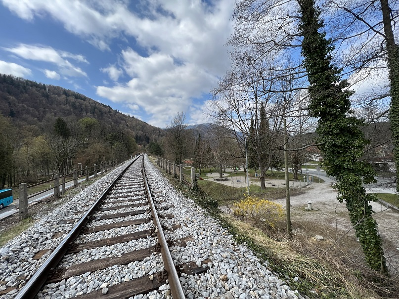

### Županjin manever se razkriva

#### Zaskrbljeni krajani Smolnika in Ruš
#### Ad Hoc Civilna Iniciativa

# Izjava za javnost - Županjin manever se razkriva

Spoštovani svetniki Občinskega sveta Občine Ruše!

Prejšnji teden smo se zakopali v iskanje in branje zakonov 
s področja prostorskega planiranja, saj nismo mogli razumeti 
kdo je dal leta 2020 županji ge. Urški Repolusk pooblastilo 
za zamenjavo parcelnih številk v obstoječem sklepu, objavljenem 
v Uradnem listu leta 2017. S tem je ga. županja Urška Repolusk 
prestavila potek trase ceste na novo lokacijo.

Moramo reči, da takšno početje zelo preseneča tudi ljudi s 
katerimi smo se pogovarjali v relevantnih institucijah v naši 
državi. Zaradi tega navajamo nekaj dejstev, kako bi moral potekati 
postopek, če bi bil v skladu z zakoni in zdravo pametjo. Ob tem 
upoštevamo tudi dejstvo, da je županja ga. Urška Repolusk hotela 
umestiti prestavljeno traso na območje, kjer ni bila predvidena 
cesta v krovnem prostorskem načrtu Občine Ruše (OPN).

1. Prva stvar, ki je problematična je, da občinska uprava ni 
odprla novega postopka podrobnega prostorskega načrta (OPPN) 
ampak je maja 2020 “kobajagi” spremenila star sklep na način, 
da je zamenjala parcelne številke obstoječe trase ceste s 
parcelnimi številkami nove trase ceste ob železnici. 
<u>Predvidevamo, da se je s tem hotela izogniti vsem spodaj 
navedenim členom zakonov!</u>

2. Predvidevamo, da se je županja s tem manevrom hotela izogniti 
sledečemu členu zakona, ki bi ga morala v vsakem primeru upoštevati 
(Zakon o prostorskem načrtovanju (ZPNačrt) – 2007, Spremembe B – 2012):
  

57. člen 
(začetek priprave občinskega podrobnega prostorskega načrta) 
.... 
(2) Kadar se občinski podrobni prostorski načrt pripravlja za območja, 
za katera v občinskem prostorskem načrtu njegova priprava ni bila predvidena, 
<u>sklep o začetku postopka priprave sprejme občinski svet</u>. 
....  

<b>Takšno spremembo trase bi lahko torej udejanil samo <u>Občinski svet Občine Ruše</u>.</b>
  
	
3. V letu 2020 je veljal že novi zakon (Zakon o urejanju prostora – ZUreP-2 – 2017), 
po katerem bi morala ga. županja Urška Repolusk pripraviti izhodišča za novo 
(prestavljeno) traso. V tej **predhodni fazi je bila dolžna vključiti tudi 
javnost**, ter pridobiti pobude in predloge glede potreb in interesov v prostoru.
  

2.2.2. Postopek priprave OPPN 
118. člen 
(izhodišča za pripravo OPPN) 
(1) Odločitev za pripravo OPPN temelji na odločitvah in usmeritvah iz OPN, 
<b>izhodiščih za pripravo OPPN, če se ta pripravlja na podlagi izkazane potrebe 
občine in ni predviden v OPN</b>, ali na pobudi investitorja priprave OPPN. 
(2) <b>Če usmeritve za pripravo OPPN v OPN niso vnaprej podane ali celovite, 
se pripravijo izhodišča za pripravo OPPN ob smiselni uporabi 
določb 108. člena tega zakona.</b> 
...  
2.1.2. Postopek priprave OPN 
108. člen 
(izhodišča za pripravo OPN) 
... 
(3) Izhodišča se oblikujejo ob sodelovanju udeležencev urejanja prostora. 
<b>V ta namen občina pri oblikovanju izhodišč zagotovi sodelovanje zainteresirane 
javnosti v obliki zbiranja predlogov in pripomb, javnih posvetov ali delavnic, 
in se posvetuje z nosilci urejanja prostora in drugimi udeleženci urejanja 
prostora.</b>

  
	
Že od vsega začetka navajamo in opozarjamo, da je po našem mnenju postopek 
peljan na popolnoma napačen način. <b>Sedaj smo našli tudi morebitni dokaz, 
da je ga. županja Urška Repolusk najbrž iskala bljižnico, ki pa po našem 
mnenju ni najbolj legalna in v skladu z veljavnimi zakoni.</b>

Moramo pa opozoriti še na sledeče. Že v samem začetku (februarja 2022) 
smo ugotovili, da je ga. županja Urška Repolusk iskala pokritje za svoje 
početje v proračunih od leta 2020 naprej in v zaključnem računu 2019 
(ki se sprejema sredi leta 2020). Pri tem je pozabila, da **za leto 2019 
nima nikakršnega pokritja v proračunu. Vso projektno dokumentacijo in 
izbiro nove trase decembra 2019 (s strani projektantov) je ga. županja 
Urška Repolusk izdelala brez kakršnegakoli pokritja v proračunu 
Občine Ruše.** Še več, v proračunu za 2020 in v zaključnem računu 
(bilanci) za leto 2019 je (pisano) v preteklem času iskala pokritje 
za nazaj.

<b>Najbolj pa je zanimivo dejstvo, da je (npr.) v proračunu za leto 2022, 
ki ima reci in piši 222 (dvestodvaindvajset) strani, obvoznica (ki je 
v celoti vredna 21+ mio EUR) omenjena v <u>enem samem stavku</u>!!!</b>

**Predvidevamo, da se ta (en) stavek lahko zelo hitro spregleda, če ga 
ne iščeš namenoma.**

Nam je popolnoma jasno, da je ge. županji Urški Repolusk ostalo zelo 
malo maneverskega prostora. S citiranjem proračunov in zaključnih 
računov išče pokritje za svoje manevre in izgovor, da so svetniki 
Občinskega sveta Občine Ruše preko tega bili seznanjeni z njenim 
početjem. Jasno je tudi zakaj na vsak način županja ga. Urška Repolusk 
zahteva od Občinskega sveta sprejem njenih zvitih in zavitih sklepov.

**Po našem mnenju bi morala ga. županja Urška Repolusk postopati popolnoma 
drugače in v celoti upoštevati zakone s področja prostorskega planiranja!**

  
Ruše, 5. maj 2022   
V imenu civilne iniciative  
Jasmina Vrečko Rupnik, Gregor Vrečko

 
	

**Slika**: Prestavljena trasa zahodnega dela obvoznice Ruše

 
	
[Kazalo](index-izjave-za-javnost.md)

                                    