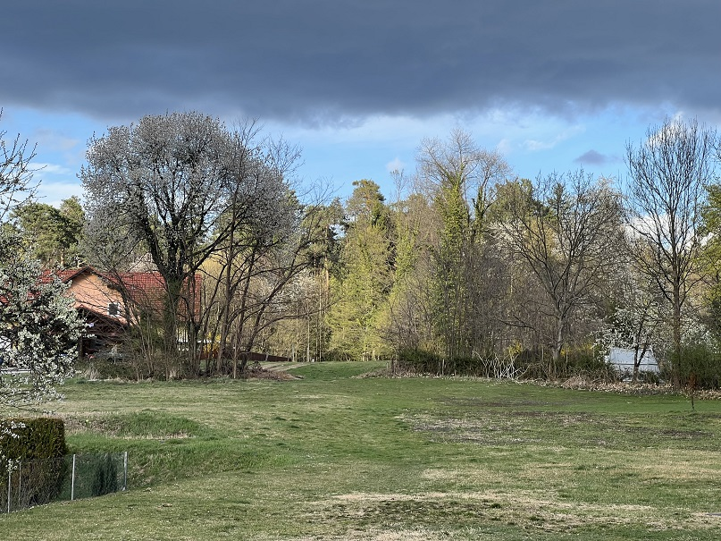

### Biti ali ne biti? To je zdaj vprašanje!

#### Zaskrbljeni krajani Smolnika in Ruš
#### Ad Hoc Civilna Iniciativa

# Izjava za javnost - Biti ali ne biti? To je zdaj vprašanje!

Ob koncu medijsko aktivnega tedna za našo občino smo z mešanimi 
občutki gledali posnetek sedme izredne seje, kjer je sedel samo 
en (1!) svetnik skupaj z županjo, direktorico občinske uprave, 
vodjo oddelka za prostor, ter zapisnikarico. Med njimi pa je 
veselo švigala avtomatska kamera in snemala nelagodje vseh prisotnih.

Sejo, ki ni bila sklepčna je ga. županja Urška Repolusk izkoristila, 
da je kot iz prižnice svetnikom Občinskega sveta Občine Ruše pridigala 
in žugala, da se bodo volilci že odločili za tistega, ki mu je 
mar za vse občane (razen seveda za peščico).

V predlog novega krovnega prostorskega načrta (OPN-SD2) je ga. županja 
Urška Repolusk namreč na svojo roko vnesla prestavljeno traso zahodnega 
dela obvoznice Ruše, ki po njenem mnenju tangira samo peščico ljudi. 
Sedaj pa ga. županja Urška Repolusk insistira, da svetniki izločijo 
to traso iz predloga krovnega prostorskega načrta (OPN-SD2). 
Sama je ne misli izločiti, ker kot pravi ne bo zastopala 
interesov te iste peščice ljudi?!?!

Svetniki seveda nikoli niso soglašali z umestitvijo te trase v 
predlog OPN-SD2. <b>Še več, kar je še huje, niti vedeli niso, da 
je bila obstoječa trasa prestavljena <u>na željo neke druge peščice 
ljudi</u>, na način, da so se naskrivaj zamenjale parcelne številke 
trase.</b>

Že večkrat smo ugotavljali, da ga. županja Urška Repolusk bega 
iz ene izjave v drugo. Iskreno upamo, da bo županja 
ga. Urška Repolusk vseeno umirila strasti. S takšnimi 
zapisi in izjavami, ki jih je podala na sedmi izredni seji, 
pred in po njej, se po našem mnenju v naši občini nažalost 
bližamo segregaciji, ter razdoru med krajani in sosedi.

Županja ga. Urška Repolusk je sicer zelo diplomatsko izjavila, 
da se v tem mandatu ne bo več debatiralo o obvoznici, kakor 
tudi ne o prostorskem razvoju naše občine.
  
	
<b><u>Zavedati pa se moramo sledečega!</u></b>

Občina Ruše je na Ministrstvo za okolje in prostor posredovala 
dopolnjen osnutek občinskega prostorskega načrta OPN-SD2 
<b>z vključenima obema trasama ceste</b> in okoljsko poročilo za 
objavo na portalu z namenom pridobivanja sklepa o ustreznosti 
okoljskega poročila.

<b><u>Tega postopka Občina Ruše do sedaj še ni preklicala, 
čeprav bi ga v skladu z prepovedjo svetnikov morala!</u></b>

Še več, zapisali so, **da tega ne morejo narediti**, kar pa so 
**na Ministrstvu za okolje in prostor zanikali in izjavili, da gre 
le za navadno politično floskulo.**

Z vso zaskrbljenostjo ugotavljamo, da imamo trenutno pač takšno 
županjo, **ki govori eno, dela pa drugo!**

  
Ruše, 12. maj 2022   
V imenu civilne iniciative  
Jasmina Vrečko Rupnik, Gregor Vrečko

 
	

**Slika**: Obstoječa - 30 let stara trasa zahodnega dela obvoznice Ruše

 
	
[Kazalo](index-izjave-za-javnost.md)

                                    