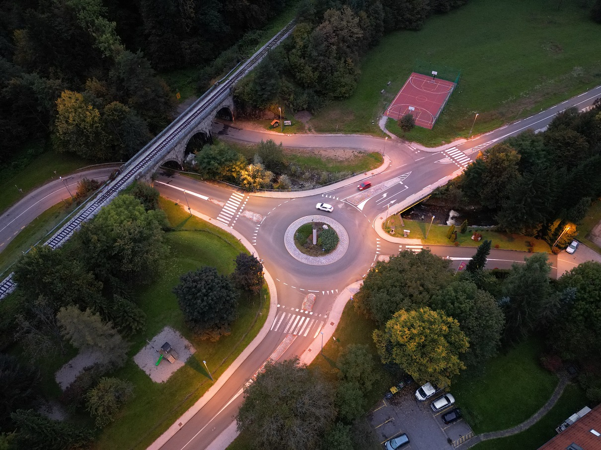

### Zatišje pred neurjem!

#### Zaskrbljeni krajani Smolnika in Ruš
#### Ad Hoc Civilna Iniciativa

# Izjava za javnost - Zatišje pred neurjem!

Po dopustniškem času in zatišju, ki ga je ga. županja 
Urška Repolusk napovedala na zadnji propadli seji Občinskega 
sveta Občine Ruše, se je spet zgodilo. Medij, ki pogosto 
objavlja leporečne članke o županji in njene intervjuje, 
je enostransko dregnil v letos aktualno temo obvoznice.

Člani civilne iniciative sicer ne vemo, ali je vodstvo 
Občine Ruše kakorkoli sodelovalo pri oblikovanju prispevka 
v delu, ki se nanaša na obvoznico, vendar je informacija 
podana glede obvoznice veliko posploševanje dejstev in 
izkrivljanje resnice.

<b>Na vsak tak enostranski zapis v medijih se bomo odzvali!</b>

V prispevku namreč za edinega krivca, da center Ruš še 
ni razbremenjen prometa krivijo svetnike, ker so februarja 
letos županji prepovedali delovanje na prestavljeni trasi 
zahodnega dela obvoznice, ki poteka vzdolž železniške proge. 
Takšen zapis je seveda nonsens, saj do februarja letos svetniki 
niso bili niti seznanjeni, da je bila obstoječa trasa prestavljena 
na način, da so se s spremembo sklepa v Uradnem listu občin s 
strani županje zamenjale parcelne številke trase.

Za malo bolj celovito sliko je potrebno pogledati nekaj manj kot 
štiri leta v preteklost. Takrat, takoj po nastopu svojega sedanjega 
mandata, je ga. županja Urška Repolusk pričela z aktivnostmi za 
prestavitev trase obvoznice na novo lokacijo, kljub temu, da je 
prejšnji župan pridobil že kar nekaj dokumentacije za staro traso.

Ga. županja Urška Repolusk je torej takrat brez vednosti svetnikov, 
ljudi, ki živijo ob novi trasi in konec koncev brez vednosti občanov 
Ruš pričela prestavljati traso na novo lokacijo. Je pač tako, da bo 
morala na tak ali drugačen način tudi prevzeti svojo odgovornost za 
časovni zamik izgradnje zahodnega dela obvoznice Ruš.

Vsekakor pa lastno odgovornost ni moralno in etično tako lahkotno 
prelagati na druge.

  
Ruše, 3. oktober 2022   
V imenu civilne iniciative  
Jasmina Vrečko Rupnik, Gregor Vrečko

 
	

**Slika**: Park z otroškim igriščem na Smolniku in krožišče, kjer 
           bi se prestavljena obvoznica pričela. Novo večnamensko
           igrišče na Smolniku.

 
	
[Kazalo](index-izjave-za-javnost.md)

                                    