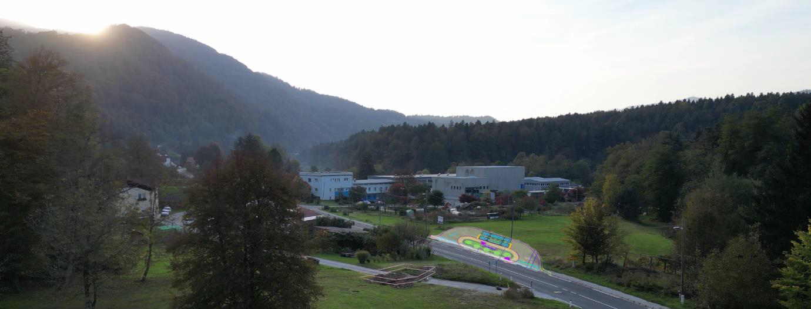
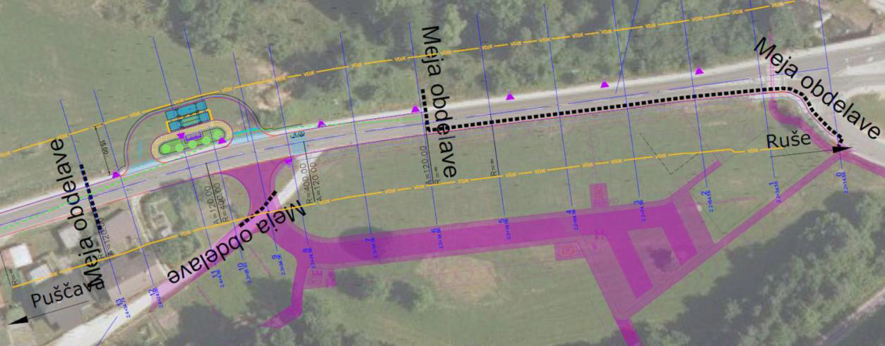
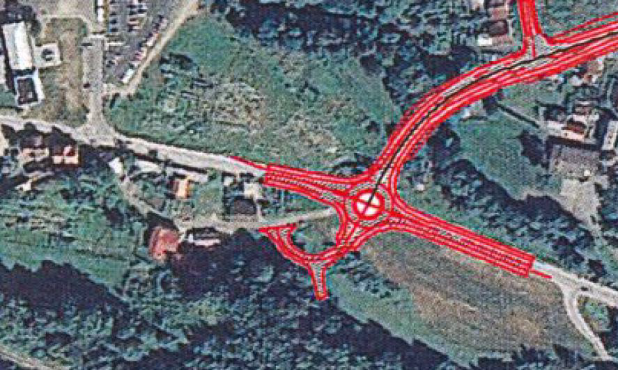

### Avtobusno obračališče ali kako po bližnjici do prestavljene trase zahodnega dela obvoznice Ruše?

#### Zaskrbljeni krajani Smolnika in Ruš
#### Ad Hoc Civilna Iniciativa

# Izjava za javnost - Avtobusno obračališče ali kako po bližnjici do prestavljene trase zahodnega dela obvoznice Ruše?

Spoštovani svetniki Občinskega sveta Občine Ruše!

V prvem predlogu proračuna za leto 2023 je samo na 
enem mestu vpisan stavek, da namerava Občina Ruše 
kupiti zemljišče št. 208/1 z namenom prestavitve 
avtobusnega obračališča na Smolniku in to brez širše 
obrazložitve. To sicer samo po sebi ne bi bilo sporno, 
če avtobusno obračališče županja Urška Repolusk ne bi 
**umestila točno na mesto, kjer se obstoječa trasa zahodnega 
dela obvoznice Ruše priključi na cesto Ruše – Puščava – Lovrenc**.

Obstoječe avtobusno obračališče pri nekdanji tovarni Metalplast 
se premika na novo lokacijo bolj vzhodno - h krajevni oznaki 
Smolnik ob severno stran ceste in bo vključevalo tudi avtobusno 
postajo.

Po našem mnenju se porablja dragocen davkoplačevalski denar za 
»ekspresno« umeščanje avtobusnega obračališča zapakiranega v 
dokumentacijo križišča za dostop do nove soseske RU04 – bodoče 
naselje hiš ob novem športnem igrišču na Smolniku.

<b>Soseska RU04 v tem trenutku ni nič drugega kot travnik!</b>

**Avtobusno obračališče se umešča na zaščiteno parcelo, 
točno na lokaciji obstoječe trase zahodnega dela 
obvoznice Ruše**, za katero smo Rušani hranili parcele 
trideset let! **Obstoječa trasa obvoznice je del pravnega 
reda Občine Ruše in je vrisana v trenutno veljavni krovni 
prostorski načrt Občine Ruše!**

V kolikor županji Urški Repolusk ta manever kakorkoli uspe, 
se bo izničila zelo lepo zamišljena trasa ceste z blagim 
zavojem preko potoka Lobnica in naprej po koridorju do 
Selniške ceste, kot so si jo v preteklosti dobro zamislili 
urbanisti.

Nad ravnanjem županje Urške Repolusk in občinske uprave 
Občine Ruše smo zelo razočarani! Apeliramo na vse svetnike 
Občinskega sveta Občine Ruše, da takšno ravnanje preprečijo! 
Projekti za sosesko RU04 kot tudi najnovejši idejni projekt 
križišča za sosesko RU04 se ne prilagajajo obstoječi trasi 
obvoznice.

Slika 1: V fotografijo Smolnika z nekdanjo tovarno Metalplast 
je vrisana lokacija avtobusnega obračališča 
(shema obračališča je iz dokumentacije Občine Ruše).
 

Slika 2: Izsek iz idejne zasnove križišča z avtobusnim obračališčem 
Občine Ruše. V načrtih se lepo vidi, da se ni upoštevala obstoječa 
trasa obvoznice, ki bi morala biti priključena na to isto križišče 
na cesti Ruše – Puščava – Lovrenc. Sedaj se na isto mesto, kjer bi 
se morala priključiti obvoznica, umešča avtobusno obračališče. 
Na križišče se priključuje tudi bodoča soseska RU04.
 

Slika 3: Potek obstoječe trase obvoznice in njena priključitev na 
cesto Ruše – Puščava – Lovrenc na tej isti lokaciji. Priključitev 
obvoznice je zamišljena z krožiščem.
 

**Premikanje oz. korigiranje priključitve obvoznice na zahod 
(v smeri proti nekdanji tovarni Metalplast), kot to 
»zelo suhoparno in lahkotno« ter brez vsakršne navedbe podlag 
v analizah in študijah predlaga občinska uprava Občine Ruše 
v obrazložitvi ob ponovnem predlogu proračuna v prvem branju 
za leto 2023, bi popolnoma spremenilo lepo zasnovan direktni 
potek in blago krivuljo obvoznice v tem delu.**

**Ali bi se lahko zgodilo, da bi izvedba obstoječe trase 
obvoznice zaradi avtobusnega obračališča postala celo 
nemogoča? Vsekakor!**

**Po mnenju civilne iniciative je to najbrž tudi glavni 
namen umestitve avtobusnega obračališča točno na 
lokacijo, kjer je v krovnem prostorskem načrtu 
Občine Ruše umeščena priključitev obstoječe trase 
zahodnega dela obvoznice na cesto 
Ruše – Puščava – Lovrenc.**

  
Ruše, 12. marec 2023   
V imenu civilne iniciative  
Jasmina Vrečko Rupnik, Gregor Vrečko

 
	
[Kazalo](index-izjave-za-javnost.md)

                                    