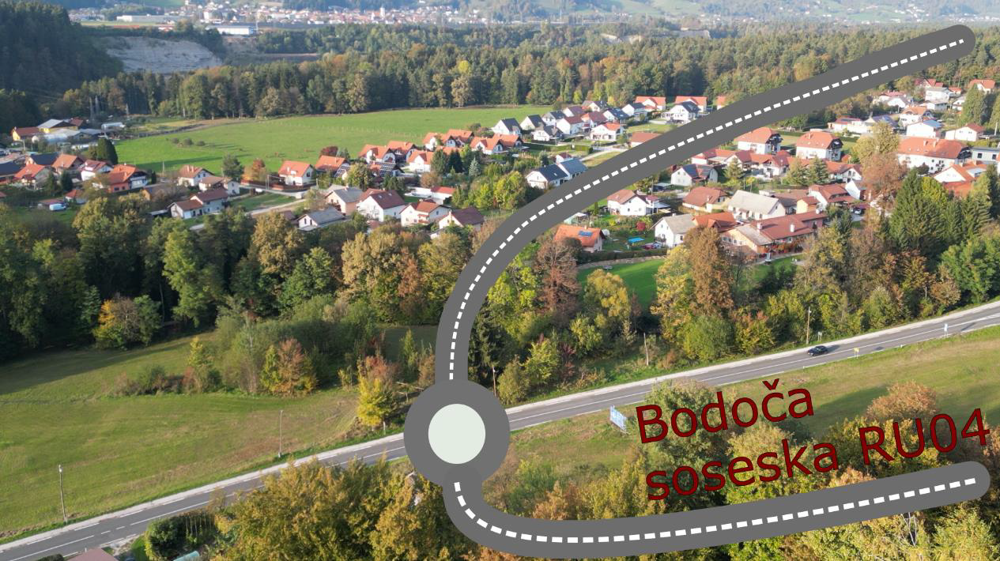

### Legoland

#### Zaskrbljeni krajani Smolnika in Ruš
#### Ad Hoc Civilna Iniciativa

# Legoland

Počasi si sestavljamo sliko iz veliko puzlov glede umestitve 
avtobusnega obračališča direktno na obstoječo traso obvoznice. 
Zato smo tudi z velikim zanimanjem pogledali posnetek četrte seje 
Občinskega sveta Občine Ruše, ker smo upali, da bomo dobili še 
kakšno uporabno informacijo.

Ampak – ob poslušanju vodje oddelka za prostor 
(Posnetek seje 1h:17m:45s, [video](https://youtu.be/jarajhf6xpE?t=4663))
smo bili tako zmedeni, da smo si sami naredili 
transkript tega dela seje. Preberemo transkript prvič, 
pa drugič in tretjič, petič, ter že desetič... Na 
koncu ne vemo, ali je kaj narobe z nami, da ne 
razumemo?! Ali je bilo mogoče avtobusno obračališče in 
krožišče prezentirano na tak način, da naj noben občan tega 
ne bi razumel? Bo že tako, kot se je izrazila sama županja 
»debatni krožek«, ki ga mi nikakor nismo razumeli!

**V kolikor bi bilo umeščanje avtobusnega obračališča dobro 
premišljeno in načrtovano bi najbrž tudi na seji Občinskega 
sveta Občine Ruše z lahkoto zelo kakovostno, ter svetnikom in 
občanom lahko razumljivo prezentirali umestitev. Tako pa...**

Po gledanju posnetka seje se nam je nehote porodil občutek, 
da v naši občini zlagajo ceste kot lego kocke. Pri lego kockah 
je namreč vse možno zgraditi! Ampak, pri aplikaciji maket iz 
lego kock v prostor, pa se je potrebno dobro zavedati, da 
vsak modelček ni uporaben, niti izvedljiv!

Če povzamemo, na bodoče križišče s štirimi kraki, kjer je 
na eni strani dostop do bodoče soseske RU04 
(ki je sedaj še travnik) so na drugo stran umestili 
izvoz iz avtobusnega obračališča?!

**Sprašujemo se ali ni križišče po svoji definiciji 
namenjneno primarno križanju cest** (Falska cesta, 
obvoznica, bodoča soseska RU04)**?** Najbrž se zelo motimo, 
saj so na Občini Ruše prepričani, da je edina prava rešitev 
križišče z izvozom avtobusnega obračališča (Falska cesta, 
izvoz avtobusnega obračališča, bodoča soseska RU04). Malo 
nižje proti nekdanji tovarni Metalplast (predvidevamo, da 
nekje pri lokaciji garaž ob Falski cesti) se bo 
mikrolokacijsko prestavilo in umestilo krožišče 
ali pa križišče za priključitev obvoznice.

<u>Vse lepo in prav za planerje urbanega prostora v Občini Ruše.</u>

**Nam se pa to zdi skregano z vsakim kmečkim razumom, estetiko 
urbanega prostora, kakor tudi z uporabnostjo urbanega prostora!**

Za lažjo predstavo smo naredili prikaz (kot si ga mi predstavljamo), 
saj je objavljena dokumentacija zelo skopa.

Slika 1: Tako nekako bi izgledala situacija, 
če bi se držali tega, kar je zapisano v 
veljavnem krovnem prostorskem načrtu 
Občine Ruše (OPN).
 

Slika 2: Tako bo izgledala celovita ureditev 
»mikrolokacije«, kot si jo je najbrž zelo na 
hitro zamislila Občina Ruše. Vsaj tako smo 
razumeli pojasnila občinske uprave.

  
Ruše, 15. marec 2023   
V imenu civilne iniciative  
Jasmina Vrečko Rupnik, Gregor Vrečko

 
	
[Kazalo](index-izjave-za-javnost.md)

                                    