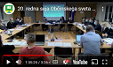

Zaskrbljeni krajani Smolnika in Ruš
 
Ad Hoc Civilna Iniciativa 

[Prva stran](index.md)

# Kronologija prestavitve obvoznice

V tem dokumentu smo pripravili kratek povzetek kronologije dogajanja glede 
zahodnega dela obvoznice Ruše. 

Na zgornji sliki bo prestavljena trasa obvoznice izgrajena na levi strani 
železniške proge, na desni pa je obstoječa Falska cesta in industrijska cona.

## 2009

### 11. april 2009 - Odlok o strategiji prostorskega razvoja Občine Ruše

Za kasnejše celostno razumevanje problematike izpostavljamo Odlok o strategiji
prostorskega razvoja Občine Ruše. V odloku je yapisano, da bo Občina Ruše 
vzpodbujala razvoj in širitev naselij, tudi naselja na Smolniku. Pri 
načrtovanju prostorskega razvoja bo upoštevala kulturno dediščino in jo 
varovala (hiša Falska cesta 124).

Občina bo podpirala gradnjo obvoznice, hkrati pa si bo prizadevala za izboljšanje 
stanja mirujočega prometa v občinskem središču.

Podpirala bo gradnjo drugega tira železniške proge in varovala koridor za gradnjo
tega tira, ki bo potekal po levi strani (južni) obstoječega tira.

### 14. oktober 2009 - Izbrali optimalno traso ceste

V članku v spletnem mediju Žurnal 24 je bil objavljen članek z naslovom
[Izbrali optimalno traso ceste](https://www.zurnal24.si/slovenija/izbrali-optimalno-traso-ceste-57091).
Izbirali so med več variantami tras.

**Zakaj moramo torej danes ponovno izbirati traso?!**

### 21. december 2009 - Diplomsko delo na temo obvoznice Ruše

Konec leta 2009 je nastalo diplomsko delo 
[Analiza družbeno-ekonomskih kriterijev pri vrednotenju projektov cestne infrastrukture - primer obvoznice Ruše](https://dk.um.si/IzpisGradiva.php?id=11809&lang=slv).
V diplomskem delu je jasno prikazana tudi slika štirih variant obvoznice na zahodu Ruš.

Nekako smo razbrali, da je bilo vrednotenje iz leta 2009 primer dobre 
prakse, potem pa se čas zavrti naprej in postane današnje
vrednotenje po našem mnenju primer najslabše možne prakse.

## 2011

### Maj 2011 - Priporočilo Ministrstva za infrastrukturo in prostor

Maja 2011 je Ministrstvo za infrastrukturo in prostor izdalo: **Priporočilo
občinam za zgodnejše vključevanje javnosti v postopke priprave prostorskih
aktov lokalnih skupnosti** na katerega **se županja Ruš ga. Urška Repolusk požvižga**.

Priporočilo zelo jasno navaja in občinam priporoča, da takoj po sprejetju 
sklepa župana o začetku postopka priprave OPN in OPPN pričnejo z aktivnostmi 
vključevanja javnosti. Navedeno je tudi kako naj občine to izvedejo in zakaj. 
Razlog, ki so ga izrecno navedli je v tem, da če se ne vodi postopek na tak 
transparenten način pogosto pride do konflikta z javnostmi. To lahko proces 
načrtovanja močno upočasni ali celo ustavi.

Ga. županja Urška Repolusk je v Ruškem utripu zelo jasno napisala, da faza 
postopka vključevanja javnosti, ki vključuje tudi aktivno obveščanje lastnikov 
ob trasi, sploh še ni nastopila. Prav tako je navedla, da je tudi študijo 
variant, strokovne podlage z gradivom za prvo branje sprememb in dopolnitev 
OPN nameravala predstaviti občinskemu svetu šele v prvi polovici leta 2022. 
Iz zgoraj omenjenega priporočila pa izhaja, da je takrat za morebitne 
spremembe že dosti prepozno.

## 2013

### 24. maj 2013 - Sklep - Pričetek priprave OPN-SD2

V letu 2013 je v uradnem glasilu slovenskih občin, št. 20/2013 objavljen **sklep o 
pričetku priprave sprememb in dopolnitev občinskega prostorskega načrta občine 
Ruše – 2.spremembe in dopolnitve (OPN-SD2)**. Določeno, da se spremeni namenska raba 
v območju predvidene **obvoznice, za katero je že izvedena in revidirana primerjava 
variant ter na podlagi opravljene recencije že izbrana varianta**, ni pa bila v OPN 
spremenjena namenska raba prostora. 

## 2017

### 12. september 2017 - Sklep - Začetek del na obstoječi trasi

**Sklep o začetku postopka priprave Občinskega podrobnega prostorskega načrta** (OPPN) 
za obvoznico Ruše – faza 1 (stara trasa), Uradno glasilo slovenskih občin 44/15.09.2017. 
Prejšnji župan je hotel pričeti z izgradnjo ceste predvsem z namenom dostopa do 
Matavškove jame in hiš. Po naših podatkih Slovenske železnice že nekaj časa zahtevajo
in pričakujejo, da se zapre prehod čez železniško progo, ki je varovan samo z Andrejevim križem. 

### 15. december 2017 - Odločba - Obstoječa trasa je popolnoma sprejemljiva za državne organe

**Odločba Ministrstva za okolje in prostor št. 35409-325/2017/5 z dne 15.12.2017**
Z odločbo je odločeno, **da za obvoznico Ruše (stara trasa) ni treba izvesti
celovite presoje vplivov na okolje**.

## 2018

**Nastop mandata ge. Urške Repolusk december 2018**.

## 2019

### December 2019

Izdelano je že veliko dokumentacije za novo traso obvoznice. 

**Nova trasa izbrana s strani stroke že decembra 2019!**

To je napisano v dokumentu (ne moremo se izraziti drugače) 
s porogljivim podnaslovom: **Povzetek za javnost**. Po mnenju
županje Ruš ge. Urške Repolusk, pa doslej (april 2022) **še ni nastopil 
čas za obveščanje ljudi ob trasi, niti čas za obveščanje javnosti**.

## 2020

### 19. maj 2020 - Sklep - Zamenjava parcelnih številk - Zamenjava trase 

**Sklep o spremembah in dopolnitvah sklepa o začetku postopka priprave občinskega 
podrobnega prostorskega načrta (OPPN) za obvoznico Ruše – faza 1, Uradno glasilo 
slovenskih občin 28/29.05.2020**.
V tem sklepu so brisane parcelne številke za staro traso in vpisane parcelne 
številke za novo traso. 

In kakšna je podlaga za sprejetje tega sklepa pod katerega je podpisana 
ga. županja Urška Repolusk? Sklep občinskega sveta? Kolikor je nam znano 
ni sklepa Občinskega sveta Občine Ruše.

## 2021

### 26. avgusta 2021 - Objavljena dokumentacija na spletni strani Občine Ruše

Potiho in dokaj skrito je Občine Ruše objavila dokumentacijo na svoji spletni strani.
To je storila skoraj leto in pol po sprejetju sklepa in zamenjavi parcelnih številk
trase.

[Projektna dokumentacija za OPPN nova trasa na spletni strani občine, objavljena šele z dne 26.08.2021](https://www.ruse.si/objava/546357)

Posamezni dokumenti iz projektne dokumentacije so narejeni že v letu 2019. 
Pri tem se nam zastavlja vprašanje ali je bila občina upravičena naročiti 
izdelavo projektne dokumentacije pred sprejetjem sklepa z dne 29. maja 2020?

Kako izgleda dostop do spletne strani z dokumentacijo si lahko vsak ustvari 
mnenje sam:

## 2022

### 4. januar 2022 - Odločba - Nova trasa ima lahko pomemben vpliv na zdravje in počutje ljudi

4\. januar 2022: 
[Odločba ministrstva za okolje in prostor št. 35409-366/2021-2550-16](https://www.gov.si/assets/ministrstva/MOP/Dokumenti/CPVO/Odlocbe/obcinski-podrobni-prostorski-nacrti/I-stopnja/2022/01.pdf)

Z odločbo Ministrstva za okolje in prostor je odločeno, da bo za novo traso 
**potrebno izvesti postopek celovite presoje vplivov na okolje**, saj bi **izvedba** 
zahodnega dela obvoznice Ruše, **v obliki in obsegu, kot je opisan v osnutku plana, 
lahko imela pomemben vpliv na zdravje in počutje ljudi**. Ministrstvo za okolje in 
prostor v odločbi tudi jasno oznani, da se bo rušilo **nekaj hiš** in **ne samo ena**,
kot trdita projektant in Občina Ruše. To je očiten znak, da Občina Ruše in projektant 
**z nekim namenom nista upoštevala dovolj širokega koridorja za prestavljeno traso 
zahodnega dela obvoznice ob severnem robu železnice**.

V občinskem glasilu 
[Ruški utrip, str. 15](https://www.ruse.si/objava/604392), županja pove, da se je naročila 
izdelava celovite presoje vplivov na okolje.

### 7. februarja 2022 - Krajani izvemo za premik trase zahodnega dela obvoznice

**Županja ga. Urška Repolusk nas občane na zelo aroganten in popolnoma neprimeren
način obvesti o novi trasi zahodnega dela obvoznice Ruše**. Da se pripravlja
premik trase obvoznice nas obvesti kar preko profila na spletnem družbenem omrežju 
Facebook. Obstoječa trasa je že 30 let vrisana v prostorske načrte. Županja ga.
Urška Repolusk pa jo namerava premakniti ob severni rob železniške proge 
Maribor - Prevalje, številka 34, med železniško postajo Ruše in viaduktom 
na Smolniku.

### 15. februarja 2022 - Sestanek Krajevnega odbora Smolnik

Prisotna tudi županja, pet svetnikov in krajani. Na tem sestanku je eden od 
svetnikov izjavil, da je županja na prvem sestanku koalicije izjavila, da 
misli prestaviti traso ceste. Nihče od prisotnih tega takrat ni zanikal. 
Svetnik pa je za to izjavo požel buren aplavz.

### 17. februarja 2022 - 20. redna seja občinskega sveta

Svetniki z veliko večino (15 glasov za, 3 vzdržani) sprejmejo sklep o 
**prepovedi črpanja** sredstev **in delovanja** za novo traso obvoznice.
Županja ga. Urška Repolusk je tekst amandmaja pred glasovanjem spremenila, 
ker ni hotela vpisati datuma začetka veljave: 1. januar 2022. 

### 22. februarja 2022 - Odgovor Zavoda za varstvo kulturne dediščine Slovenije na naše vprašanje glede dopustnosti gradnje ob robu kulturno zaščitene stavbe (stavba Falska 124)

Zavod za varstvo kulturne dediščine - Območna enota Maribor, zelo jasno pove,
da je potrebno zaradi **ohranjanja pojavnosti** in **gradbene stabilnosti**
upoštevati **ustrezno odmaknjenost trase od obstoječe stavbne dediščine**.

Predvidevamo, da bo Občina Ruše dosegla **ohranjanje pojavnosti** z <u>nevidnimi
protihrupnimi ograjami</u>. **Gradbeno stabilnost** pa bo zadostila, ker bo obvoznica
<u>odmaknjena za cel meter</u> od strehe kulturno zaščitenega objekta.

Zavod za kulturno dediščino, **še ni prejel vloge investitorja za izdajo 
kulturnovarstvenih pogojev**. Kot kaže Občina Ruše nima namena preveriti
pogoje za gradnjo obvoznice ob tej kulturno zaščiteni večstanovanjski
hiši.

Še enkrat pa opomnimo, da je Občina Ruše v skladu s strategijo razvoja iz 
leta 2009 dolžna skrbeti za kulturno dediščino. 

### 8. marec 2022 - Izid občinskega glasila Občine Ruše - Ruški Utrip

Izšelo je občinsko glasilo Občine Ruše 
[Ruški Utrip](https://www.ruse.si/Files/eMagazine/118/604392/ruski_utrip2022-1.pdf).
Že na Krajevnem odboru Smolnik, smo krajani prognozirali, da nas bo županja 
ga. Urška Repolusk obvestila preko občinskega glasila Občine Ruše o svojih 
naslednjih korakih glede zahodnega dela obvoznice Ruše. To se je zgodilo 
na dan žena. V članku z naslovom **Obvoznica Ruše** na straneh 15 - 17 nas 
občane Ruš županja obvesti, da bo še naprej, kljub <u>izrecni prepovedi</u> 
svetnikov, vztrajala pri nadaljnjih korakih umestitve nove trase v krovni 
prostorski načrt Občine Ruše (OPN).

**Tako bomo zgleda dobili v urbanističnih načrtih Ruš dve obvoznici na isti lokaciji?!**

### Medijska ofenziva 

V času med izidom članka na temo obvoznice v Ruškem Utripu in Javno predstavitvijo 
tras smo bili priča pravi mali medijski ofenzivi z leporečnimi in všečnimi članki
objavljenimi v različnih lokalnih medijih.

### 23. marec 2022 - Javna predstavitev študije variant

Kljub <u>izrecni prepovedi</u> svetnikov je županja organizirala: 
**Javno predstavitev študije variant in umestitve obvoznice Ruš v prostorske akte občine**. 
Takrat je ga. županja prvič omenila tudi referendum. Nimamo informacije, zakaj in komu je 
bila ta javna predstavitev namenjena. Lahko pa si mislimo, da bo najbrž služila v postopku
umeščanja nove trase obvoznice v krovni prostorski načrt (OPN). Pred javno predstavitevijo
smo bili obveščeni, da se bo vodil tudi zapisnik in lista prisotnosti, vendar smo teden 
kasneje bili seznanjeni s strani Občine Ruše, da se zapisnik ni vodil.

Javna predstavitev je posneta in si jo lahko vsak tudi pogleda: 

Študija hrupa, ki jo je Občine Ruše po naših podatkih naročila konec leta 2021, 
dve leti po tem, ko je izbrala novo traso za obvoznico, ni upoštevala projekcije
železniškega prometa. Niti ni vzela v obzir drugega tira, ki bo morebiti izgrajen
v prihodnosti.

Ob tem pripominjamo, da je med predvidenimi projekti v občini Ruše tudi 
nadgradnja železniške proge Maribor-Prevalje in sicer v obdobju od leta
2024 do leta 2027.

### 11. april 2022 - Občino Ruše smo opozorili na napako v zapisniku

Občina Ruše in svetnike Občinskega sveta Občine Ruše smo 
opozorili, da se **tekst amandmaja** k proračunu Občine Ruše za leto 2022,
**v zapisniku ne glasi točno tako, kot ga je prebrala ga. županja** na
20\. redni seji Občinskega sveta Občine Ruše pred glasovanjem.

Pred sprejemom zapisnika 20. redne seje je **potrebno popraviti tekst**
amandmaja (8. sklep). 

Ker je tema o obvoznici zelo pereča smo opozorili
go. županjo in občinsko upravo, da to nemudoma stori. Izredno pomembno
je, da je občinska uprava posebej natančna pri formulaciji in ne 
**poskuša post festum** spreminjati besedila sklepov in s 
tem **izkrivljati njihovega pomena**.

Tekst amandmaja, ki ga je prebrala ga. županja Urška Repolusk pred glasovanjem
na 20. seji Občinskega sveta Občine Ruše (sklep št. 8):

<blockquote>
Občinski svet Občine Ruše prepoveduje vse nadaljne postopke in črpanje 
proračunskih sredstev iz postavke 421 (izdelava prostorskih aktov/področje 
prostorskega planiranja), v zvezi z novo traso Ruške obvoznice. Aktivnosti se 
lahko nadaljujejo le na podlagi posebnega soglasja Občinskega sveta Občine 
Ruše. Županja mora na naslednjo sejo Občinskega sveta Občine Ruše uvrstiti točko 
dnevnega reda, o aktivnostih in finančnih posledicah za proračun od 1.1.2019 
dalje, v zvezi z načrtovanjem vseh tras Ruške obvoznice. Sredstva iz omenjene 
postavke, pa se lahko izrecno uporabijo za drugo prostorsko planiranje in 
izdelavo prostorskih aktov, ki z obvoznico niso povezani. 
</blockquote>

Primerjava besedila:
 - Levo: zapisnik - napačna formulacija!!!.
 - Desno: sprejeto besedilo, ki ga prebere ga. županja pred glasovanjem.

Sklep napačno formuliran v zapisniku. Izgubi se dejanski pomen amandmaja.

Ga. županja prebere amandma na 20. seji Občinskega sveta Občine Ruše (1h:34m:20s).

### 12. april 2022 - Občina Ruše se spreneveda, da ne more ustaviti postopka OPN-SD2

Takšno floskulo so na občini zapisali v pojasnilo zakaj, kljub <u>izrecni prepovedi</u> s strani
Občinskega sveta Občine Ruše, še vedno nadaljujejo z umeščanjem nove trase obvoznice v krovni 
prostorski načrt Občine Ruše (OPN SD2).

**Seveda se lahko vsak upravni postopek v trenutku ustavi, če se to hoče!**

**Lahko se tudi izvzame pobuda št. 171, ki je namenjena novi trasi obvoznice!**

V več izjavah za javnost smo opozorili, da bo ga. županja na sebe prevzela sum kršenja
veljavnih pravil v Občini Ruše, če bo v kakršnokoli presojo na Ministrstvo za okolje in 
prostor vključila tudi novo (prestavljeno) traso zahodnega dela obvoznice Ruše. 

Sum kršenja veljavnih pravil v Občini Ruše bo ga. županja prevzela na sebe tudi, če bo dala
krovni prostorski načrt (OPN SD2) z vključeno novo (prestavljeno) traso obvoznice v potrditev 
svetnikom Občinskega sveta Občine Ruše.

Kot smo že zapisali v izjavi za javnost je po našem mnenju samo ga. županja Urška Repolusk 
odgovorna za 3 leta in 4 mesece časovnega zaostanka, ki ga je zaradi priprave načrtov za 
novo traso zapravila. 

Nikakor pa ne more biti "časovni zaostanek" **razlog za pritisk na svetnike**
Občinskega sveta Občine Ruše, da sprejmejo krovni prostorski načrt OPN-SD2 skupaj z novo
(prestavljeno) traso zahodnega dela obvoznice Ruše.

### 12. april 2022 - Občina Ruše predloži stroške

Stroški za obvoznico. Manjkata vsaj dve postavki, za študiji, 
ki sta pripisani. Občina ju je pozabila dodati.

- CPVO ali okoljsko poročilo, ki ga je Občina Ruše naročila v januarju 2022 po prejemu odločbe
  Ministrstva za okolje in prostor 4. januarja 2022.
- Študija obremenitve s hrupom in predlog protihrupne zaščite št. 2020-19  / PHZ.

### 13. april 2022 - Projektanti niso upoštevali zakonskih določil

Ugotovili smo, da projektanti nove (prestavljene) trase obvoznice **niso upoštevali 
zakonskih določil** glede **višinske razlike med cestiščem in zgornjim robom železniških
tirnic**. Minimalna višinska razlika je **1 meter**. Na mestu, ki je prikazan na spodnjem 
načrtu (400 metrov od krožišča pri viaduktu) so projektanti načrtovali 0,057 metra 
(5,7 centimetra) višinske razlike. 

Ni se upoštevala niti razdalja med osjo skrajnega tira do najbližje točke cestišča,
ki **znaša 8 metrov**. Po celotni trasi so upoštevali odmik **cca 6 metrov**. 

Zakaj tega niso storili nam zaenkrat še ni znano. Dejstvo pa je: če bi se upoštevala
vsa zakonska določila bi se ta del ceste zelo podražil. Posledično bi morali 
**cesto poglobiti** in **zelo razširiti koridor trase**. Cela **prva linija** 
stanovanjskih in poslovnih **hiš (9 - devet)** pa **bi se** najbrž **rušila**. 

**Ali bi bila zaradi tega vprašljiva tudi ekonomska primerjava z obstoječo traso 
in posledično izbira najbolj primerne trase?**

Zakon o varnosti v železniškem prometu (ZVZeIP-1), 28. člen:

Izsek načrta Občine Ruše za prestavljeno traso obvoznice ob železnici.
Na sliko izseka načrta smo laično vrisali odmik in razliko v višini.

### 22. april 2022 - Zahodni del obvoznice Ruše ni upravičen glede na prometne standarde

Po merilih količine prometa, ki veljajo v Republiki Sloveniji za **povezovalne ceste**, 
investicija v zahodni del obvoznice Ruše ni upravičena. 

V **Pravilniku o projektiranju cest** (Uradni list RS, št. 91/2005) je točno določeno, 
da je **minimalna količina prometa za povezovalno cesto <u>vsaj 5000 vozil dnevno</u>** 
(PLDP - povprečni letni dnevni promet). 

Na relaciji med Puščavo in Rušami pa je uradni podatek Ministrstva za infrastrukturo in 
Direkcije za infrastrukturo za leto 2020: **1000 vozil dnevno**. To je pet (5!) krat manj
od zahtevanega prometa za obvoznico (povezovalno cesto).

Kot smo že večkrat navedli, **ime obvoznica za to cesto ni pravo ime**. To je 
**lepa krajevna cesta** in je tudi glede na standarde, ki veljajo v 
Republiki Sloveniji popolnoma napačno kategorizirana. 

Na tej povezavi je izsek iz 39. člena Pravilniku o projektiranju cest, kjer je
zapisana minimalna količina prometa za povezovalno cesto (obvoznico):

<!--    -->

## 2024

### 15. februar 2024 - Končno poročilo o nadzoru; Nadzornega odbora Občine Ruše

Občina Ruše je med gradivi za sejo Občinskega sveta objavila končno poročilo Nadzornega odbora.
Končno poročilo obravnava tudi obvoznico. Nadzor nad projektom obvoznica je v gradivu podrobneje predstavljen od strani 46 do strani 61.

Končno poročilo je dosegljivo na sledeči povezavi:

[Končno poročilo Nadzornega odbora](./pdf3/2024-02-17-T8_Nadzorni_odbor_2023-177-241.pdf)

[Več o tem](2024-02-15-NadzorniOdborKoncnoPorocilo.md)

 
 

## 

[Prva stran](index.md)
 
 

