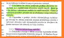

Zaskrbljeni krajani Smolnika in Ruš
 
Ad Hoc Civilna Iniciativa 

[Prva stran](index.md)

# Kronologija prestavitve neke obvoznice

V tem dokumentu smo pripravili kratek povzetek kronologije dogajanja glede 
zahodnega dela obvoznice Ruše.

## 2009

### Odlok - o strategiji prostorskega razvoja Občine Ruše (11. april 2009)

Za kasnejše celostno razumevanje problematike izpostavljamo odlok o strategiji
prostorskega razvoja Občine Ruše. Tukaj Občina Ruše pove, da bo podpirala gradnjo
drugega tira železniške proge in varovala koridor za ta tir.

## 2013

V letu 2013 je v uradnem glasilu slovenskih občin, št. 20/2013 objavljen **sklep o 
pričetku priprave sprememb in dopolnitev občinskega prostorskega načrta občine 
Ruše – 2.spremembe in dopolnitve (OPN-SD2)**. Določeno, da se spremeni namenska raba 
v območju predvidene **obvoznice, za katero je že izvedena in revidirana primerjava 
variant ter na podlagi opravljene recencije že izbrana varianta**, ni pa bila v OPN 
spremenjena namenska raba prostora. 

## 2017

### Sklep - Začetek del na obstoječi trasi

**Sklep o začetku postopka priprave Občinskega podrobnega prostorskega načrta** (OPPN) 
za obvoznico Ruše – faza 1 (stara trasa), Uradno glasilo slovenskih občin 44/15.09.2017. 
Prejšnji župan je hotel pričeti z izgradnjo ceste predvsem z namenom dostopa do 
Matavžkove jame in da se zapre prehod čez železnico, ki je varovan samo z 
Andrejevim križem.

### Odločba - Obstoječa trasa je popolnoma sprejemljiva za državne organe

**Odločba Ministrstva za okolje in prostor št. 35409-325/2017/5 z dne 15.12.2017**
Z odločbo je odločeno, **da za obvoznico Ruše (stara trasa) ni treba izvesti
celovite presoje vplivov na okolje**.

## 2018

**Nastop mandata ge. Urške Repolusk december 2018**.

## 2019

### December 2019

Izdelano je že veliko dokumentacije za novo traso obvoznice. 

**Nova trasa izbrana s strani stroke že decembra 2019!**

To je napisano v dokumentu (ne moremo se izraziti drugače) 
z porogljivim podnaslovom: **Povzetek za javnost**. Po mnenju
županje Ruš, ge. Urške Repolusk, pa doslej (april 2022) **še ni nastopil 
čas za obveščanje ljudi ob trasi, niti čas za obveščanje javnosti**.

## 2020

### 19. maj 2020 - Sklep - Zamenjava parcelnih številk - Zamenjava trase 

**Sklep o spremembah in dopolnitvah sklepa o začetku postopka priprave občinskega 
podrobnega prostorskega načrta (OPPN) za obvoznico Ruše – faza 1, Uradno glasilo 
slovenskih občin 28/29.05.2020**.
V tem sklepu so brisane parcelne številke za staro traso in vpisane parcelne 
številke za novo traso. 

In kakšna je podlaga za sprejetje tega sklepa pod katerega je podpisana 
ga. županja Urška Repolusk? Sklep občinskega sveta? Kolikor je nam znano 
ni sklepa Občinskega sveta Občine Ruše.

## 2021

### 26. avgusta 2021 - Objavljena dokumentacija na spletni strani Občine Ruše

Potiho in dokaj skrito je Občine Ruše objavila dokumentacijo na svoji spletni strani.
To je storila skoraj leto in pol po sprejetju sklepa in zamenjavi parcelnih številk
trase.

[Projektna dokumentacija za OPPN nova trasa na spletni strani občine, objavljena šele z dne 26.08.2021](https://www.ruse.si/objava/546357)

Posamezni dokumenti iz projektne dokumentacije so narejeni že v letu 2019. 
Pri tem se nam zastavlja vprašanje ali je bila občina upravičena naročiti 
izdelavo projektne dokumentacije pred sprejetjem sklepa z dne 29. maja 2020?

Kako je izgledal dostop si lahko vsak ustvari mnenje sam:

## 2022

### Odločba - Nova trasa ima lahko pomemben vpliv na zdravje in počutje ljudi

4\. januar 2022: 
[Odločba ministrstva za okolje in prostor št. 35409-366/2021-2550-16](https://www.gov.si/assets/ministrstva/MOP/Dokumenti/CPVO/Odlocbe/obcinski-podrobni-prostorski-nacrti/I-stopnja/2022/01.pdf)

Z odločbo Ministrstva za okolje in prostor je odločeno, da bo za novo traso 
**potrebno izvesti postopek celovite presoje vplivov na okolje**, saj bi **izvedba** 
zahodnega dela obvoznice Ruše, **v obliki in obsegu, kot je opisan v osnutku plana, 
lahko imela pomemben vpliv na zdravje in počutje ljudi**. Ministrstvo za okolje in 
prostor v odločbi tudi jasno oznani, da se bo rušilo **nekaj hiš** in **ne samo ena**,
kot trdi projektant in Občina Ruše. To je očiten znak, da Občina Ruše in projektant 
**z nekim namenom nista upoštevala dovolj širokega koridorja za prestavljeno traso 
zahodnega dela obvoznice ob severnem robu železnice**.

V občinskem glasilu 
[Ruški utrip, str. 15](https://www.ruse.si/objava/604392), županja pove, da se je naročila 
izdelava celovite presoje vplivov na okolje.

### 7. februarja 2022 - Krajani izvemo za premik trase zahodnega dela obvoznice

**Županja ga. Urška Repolusk nas občane na zelo aroganten in popolnoma neprimeren
način obvesti o novi trasi zahodnega dela obvoznice Ruše**. Da se pripravlja
premik trase obvoznice nas obvesti kar preko profila na spletnem družbenem omrežju 
Facebook. Obstoječa trasa je že 30 let vrisana v prostorske načrte. Županja ga.
Urška Repolusk pa jo namerava premakniti ob severni rob železniške proge 
Maribor - Prevalje, številka 34, med železniško postajo Ruše in viaduktom 
na Smolniku.

### 15. februarja 2022 - Sestanek Krajevnega odbora Smolnik

Prisotna tudi županja, pet svetnikov in krajani. Na tem sestanku je eden od 
svetnikov izjavil, da je županja na prvem sestanku koalicije izjavila, da 
misli prestaviti traso ceste. Nihče od prisotnih tega takrat ni zanikal. 
Svetnik pa je za to izjavo požel buren aplavz.

### 17. februarja 2022 - 20. redna seja občinskega sveta

Svetniki z veliko večino (15 glasov za, 3 vzdržani) sprejmejo sklep o 
**prepovedi črpanja** sredstev **in delovanja** za novo traso obvoznice.
Županja ga. Urška Repolusk je tekst amandmaja pred glasovanjem spremenila, 
ker ni hotela vpisati datuma začetka veljave: 1. januar 2022. 

### 8. marec 2022 - Izid biltena Občine Ruše - Ruški Utrip

Izšelo je občinsko glasilo Občine Ruše 
[Ruški Utrip](https://www.ruse.si/Files/eMagazine/118/604392/ruski_utrip2022-1.pdf).
Že na Krajevnem odboru Smolnik, smo krajani prognozirali, da nas bo županja 
ga. Urška Repolusk obvestila preko občinskega glasila Občine Ruše o svojih 
naslednjih korakih glede zahodnega dela obvoznice Ruše. To se je zgodilo 
na dan žena. V članku z naslovom **Obvoznica Ruše** na straneh 15 - 17 nas 
občane Ruš županja obvesti, da bo še naprej, kljub <u>izrecni prepovedi</u> 
svetnikov, vztrajala pri nadaljnjih korakih umestitve nove trase v krovni 
prostorski načrt Občine Ruše (OPN).

**Tako bomo zgleda dobili v urbanističnih načrtih Ruš dve obvoznici na isti lokaciji?!**

### Medijska ofenziva 

V času med izidom članka na temo obvoznice v Ruškem Utripu in Javno predstavitvijo 
tras smo bili priča pravi mali medijski ofenzivi z leporečnimi in všečnimi članki
objavljenimi v različnih lokalnih medijih.

### 23. marec 2022 - Javna predstavitev študije variant

Kljub <u>izrecni prepovedi</u> svetnikov je županja organizirala: 
**Javno predstavitev študije variant in umestitve obvoznice Ruš v prostorske akte občine**. 
Takrat je ga. županja prvič omenila tudi referendum. Nimamo informacije, zakaj in komu je 
bila ta javna predstavitev namenjena. Lahko pa si mislimo, da bo najbrž služila v postopku
umeščanja nove trase obvoznice v krovni prostorski načrt (OPN). Pred javno predstavitevijo
smo bili obveščeni, da se bo vodil tudi zapisnik in lista prisotnosti, vendar smo teden 
kasneje bili seznanjeni s strani Občine Ruše, da se zapisnik ni vodil.

Javna predstavitev je posneta in si jo lahko vsak tudi pogleda: 

Študija hrupa, ki jo je Občine Ruše po naših podatkih naročila konec leta 2021, 
dve leti po tem, ko je izbrala novo traso za obvoznico, ni upoštevala projekcije
železniškega prometa. Niti ni vzela v obzir drugega tira, ki bo morebiti izgrajen
v prihodnosti.

Ob tem pripominjamo, da je med predvidenimi projekti v občini Ruše tudi 
nadgradnja železniške proge Maribor-Prevalje in sicer v obdobju od leta
2024 do leta 2027.

 
 

[Prva stran](index.md)
 
 

