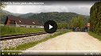

Zaskrbljeni krajani Smolnika in Ruš
 
Ad Hoc Civilna Iniciativa 

[Prva stran](index.md)

# Mediji o nas
 

## Izpostavljeno

[Večer Online - Obvoznica Ruše (4. april 2022)](https://youtu.be/wASHrHIMiEA)

[Radio Maribor - Radijska tribuna (20. april 2022)](https://www.rtvslo.si/rtv365/arhiv/174866172?s=radio)

[Kanal A - Svet - Obvoznica Ruše - Prvic (10. maj 2022)](https://www.24ur.com/novice/svet/bo-nova-obvoznica-v-rusah-tekla-cez-dvorisca-obcanov.html)

[Kanal A - Svet - Obvoznica Ruše - Drugič (11. maj 2022)](https://www.24ur.com/novice/svet/s.html)

[RTV Slovenija - Slovenska kronika - Obvoznica Ruše (11. maj 2022)](https://4d.rtvslo.si/arhiv/slovenska-kronika/174871727)

[RTV Slovenija - Tele M - Obvoznica Ruše - Začetek 1m:25s (13. maj 2022)](https://365.rtvslo.si/arhiv/tele-m/174872348)

## Kronološko

### 13. maj 2022 -- Večer - Članek
[(FOTO) Občina Ruše: Županja Urška Repolusk od obvoznice dviga roke](https://www.vecer.com/maribor/aktualno/obcina-ruse-zupanja-urska-repolusk-od-obvoznice-dviga-roke-10282783)
 
 

### 13. maj 2022 -- RTV Slovenija - Tele M  
[Bodo Rušani izgubili obvoznico?](https://365.rtvslo.si/arhiv/tele-m/174872348)
 
 
 
 
 

### 12. maj 2022 -- Lokalec (BKTV)
[7. občinske seje Občine Ruše zaradi odstotnosti svetnikov ni bilo. Vztrajajo, da niso proti občinskem prostorskemu načrtu, le proti varianti 2 zahodne obvoznice](https://lokalec.si/novice/7-obcinske-seje-obcine-ruse-zaradi-odstotnosti-svetnikov-ni-bilo-vztrajajo-da-niso-proti-obcinskem-prostorskemu-nacrtu-le-proti-varianti-2-zahodne-obvoznice/)
 
 

### 12. maj 2022 -- Lokalec (BKTV)
[Ruški svetniki: Županja onemogočila izredno sejo](https://lokalec.si/novice/ruski-svetniki-zupanja-onemogocila-izredno-sejo/)
 
 

### 12. maj 2022 -- Radio Maribor - Jutranja poročila
[Obvoznica Ruše (začetek: 1m:25s)](https://365.rtvslo.si/arhiv/jutranja-porocila-radia-maribor/174871802)
 
 
 
 
 

### 11. maj 2022 -- RTV Slovenija - Dnevnik 
[Huda kri zaradi obvoznice se nadaljuje. "V Rušah imamo kaos."](https://www.rtvslo.si/lokalne-novice/stajerska/huda-kri-zaradi-obvoznice-se-nadaljuje-v-rusah-imamo-kaos/627008)
 
 
 
 
 

### 11. maj 2022 -- Večer - Članek
[V Rušah se nadaljuje pingpong med županjo Urško Repolusk in občinskimi svetniki zaradi ruške obvoznice](https://www.vecer.com/maribor/aktualno/v-rusah-se-nadaljuje-pingpong-med-zupanjo-ursko-repolusk-in-obcinskimi-svetniki-zaradi-ruske-obvoznice-10282430)
 
 

### 11. maj 2022 -- MariborInfo.com
[Drama se nadaljuje: Ruški občinski svetniki od županje zahtevajo prevzem odgovornosti](https://mariborinfo.com/novica/politika-in-gospodarstvo/drama-se-nadaljuje-ruski-obcinski-svetniki-od-zupanje-zahtevajo)
 
 

### 11. maj 2022 -- Lokalec (BKTV)
[Zaskrbljeni krajani Smolnika in Ruš: “Županjin manever se razkriva”](https://lokalec.si/novice/zaskrbljeni-krajani-smolnika-in-rus-zupanjin-manever-se-razkriva/)
 
 

### 11. maj 2022 -- Slovenska tiskovna agencija (STA)
[Razdor med ruškimi občinskimi svetniki in županjo glede obvoznice se nadaljuje](https://www.sta.si/3035536/razdor-med-ruskimi-obcinskimi-svetniki-in-zupanjo-glede-obvoznice-se-nadaljuje)
 
 

### 11. maj 2022 -- Lokalec (BKTV) -- Posnetek tiskovne konference
[Občinski svetniki Občine Ruše glede problematike Ruške obvoznice in o zadnjih ravnanjih županje Občine Ruše](https://fb.watch/d3cxpzTULr/)
 
 
 
 
 

### 11. maj 2022 -- Kanal A - Svet
[Razdor glede ruške obvoznice se nadaljuje](https://www.24ur.com/novice/svet/s.html)
 
 
 
 
 

### 10. maj 2022 -- Kanal A - Svet
[Bo nova obvoznica v Rušah tekla čez dvorišča občanov?](https://www.24ur.com/novice/svet/bo-nova-obvoznica-v-rusah-tekla-cez-dvorisca-obcanov.html)
 
 
 
 
 

### 5. maj 2022 -- Lokalec (BKTV)
[Županja Ruš se ni odzvala na zahtevo sklica izredne seje, zato so jo sklicali svetniki sami](https://lokalec.si/novice/zupanja-rus-se-ni-odzvala-na-zahtevo-sklica-izredne-seje-zato-so-jo-sklicali-svetniki-sami/)
 
 

### 5. maj 2022 -- Lokalec (BKTV)
[Ruški občinski svetniki so bili zopet proti obravnavanju prostorskega umeščanja trase zahodne obvoznice v Rušah](https://lokalec.si/novice/ruski-obcinski-svetniki-so-bili-zopet-proti-obravnavanju-prostorskega-umescanja-trase-zahodne-obvoznice-v-rusah/)
 
 

### 27. april 2022 -- Večer - Članek
[(FOTO) Politična kriza zaradi zahodne obvoznice v Rušah se zaostruje: "Nam se ni treba odločati za eno ali drugo traso, ker ..."](https://www.vecer.com/maribor/aktualno/obcina-ruse-politicna-kriza-zaradi-zahodne-obvoznice-10280560)
 
 
	
### 20. april 2022 -- Radio Maribor - Radijska tribuna
[Radijska tribuna: Ruše - načrtovana obvoznica oziroma njeno umeščanje v prostor](https://www.rtvslo.si/rtv365/arhiv/174866172?s=radio)
 
 
 
 
 
	

### 16. april 2022 -- Slovenska tiskovna agencija (STA)
[V Rušah razburjenje zaradi poteka načrtovane obvoznice](https://www.sta.si/3025645/v-rusah-razburjenje-zaradi-poteka-nacrtovane-obvoznice)
 
 

### 11. april 2022 -- Lokalec (BKTV)
[VIDEO: Krajani Smolnika zaradi nove obvoznice na nogah](https://lokalec.si/obcine/video-krajani-smolnika-zaradi-nove-obvoznice-na-nogah/)
 
 
 
<!--  -->
 
 

### 6. april 2022 -- Večer - Članek
[(VIDEO IN FOTO) Ruško obvoznico bi speljali kar po dvoriščih krajanov, ti so ogorčeni: "Smo manjvredni ljudje?"](https://www.vecer.com/maribor/aktualno/video-in-foto-rusko-obvoznico-bi-speljali-kar-po-dvoriscih-krajanov-ti-so-ogorceni-smo-manjvredni-ljudje-10277692)
 
 

### 4. april 2022 -- Večer Online (Youtube)

[Obvoznica Ruše](https://youtu.be/wASHrHIMiEA)
 
 

### 28. marec 2022 -- Lokalec (BKTV)
[Krajani Ruš ogorčeni: “Ne razumemo, kako lahko županja Urška Repolusk še naprej zapravlja denar, energijo in čas občinske uprave”](https://lokalec.si/novice/krajani-rus-ogorceni-ne-razumemo-kako-lahko-zupanja-urska-repolusk-se-naprej-zapravlja-denar-energijo-in-cas-obcinske-uprave/)
 
 

### 24. marec 2022 -- Lokalec (BKTV)
[VIDEO: Zaradi načrtov obvoznice v Rušah izredno stanje, ljudje so razdvojeni](https://lokalec.si/novice/video-zaradi-nacrtov-obvoznice-v-rusah-izredno-stanje-ljudje-so-razdvojeni/)
 
 

 
 

### 16. marec 2022 -- Lokalec (BKTV)
[Rušani s številnimi očitki županji Ruš: “Projektiranje cest na način, kot to počne občina, je slabo in neprofesionalno”](https://lokalec.si/novice/rusani-s-stevilnimi-ocitki-zupanji-rus-projektiranje-cest-na-nacin-kot-to-pocne-obcina-je-slabo-in-neprofesionalno/)
 
 

	
### 17. februar 2022 -- Lokalec (BKTV)
[Občinski svet Občine Ruše županji prepovedal nadaljnje postopke in črpanje sredstev v zvezi z novo traso Ruške obvoznice](https://lokalec.si/novice/obcinski-svet-obcine-ruse-prepovedal-nadaljnje-postopke-in-crpanje-sredstev-v-zvezi-z-novo-traso-ruske-obvoznice/)
 
 

[Prva stran](index.md)
 
 
	
