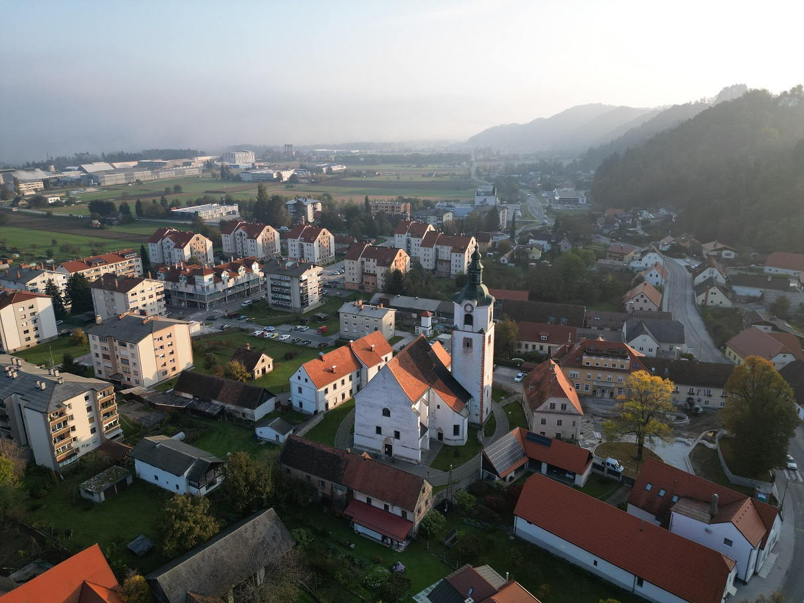

### Obvestilo - Zbiranje podpisov pod peticijo!

Zaskrbljeni krajani Smolnika in Ruš
 
Ad Hoc Civilna Iniciativa 
 

# Obvestilo - Zbiranje podpisov pod peticijo!

Spoštovani sokrajani in soobčani!

Pripravili smo tekst peticije, ki vsebuje polja za podpise. Objavili smo ga 
hkrati s tem dokumentom. Peticija za podpisovanje se nahaja na sledeči povezavi:

[Peticija](./pdf/2022-10-19-PeticijaParkirisceRuse.pdf)
 
 
[2022-10-19-PeticijaParkirisceRuse.pdf](./pdf/2022-10-19-PeticijaParkirisceRuse.pdf)

## Podpisovanje peticije smo si zamislili na več načinov:

1.	Peticija se lahko podpiše v četrtek in petek med 9. uro in 18. uro ob našem malem parkirišču pri lekarni in pošti.
1.  Peticijo se lahko podpiše v soboto med 9. uro in 13. uro ob našem malem parkirišču pri lekarni in pošti.
1.  Peticijo se lahko podpiše v soboto pred trgovino Spar med 9. uro in 17. uro.
1.  Načrtujemo še podpisovanje v Bistrici. Lokacijo in termine dopišemo.
1.	Peticijo si lahko natisne vsak posameznik in nam jo podpisano prinese na lokacije zbiranja podpisov.
1.  Vsi, ki me poznate, mi lahko podpisano peticijo izročite tudi osebno.

## Prosimo, da peticijo natisnete in jo <b>podpišete v družinskem krogu</b>.

## Prosimo, da peticijo <b>ponudite v podpis vašim sorodnikom</b>.

## Prosimo, da peticijo <b>ponudite v podpis vašim sosedom</b>.

## Prosimo, da peticijo <b>ponudite v podpis po vaši ulici</b>.

# Pokažimo upravi Občine Ruše, da nam ni vseeno za naše malo parkirišče ob lekarni in pošti!

  
Ruše, 19. oktober 2022   
V imenu civilne iniciative  
Jasmina Vrečko Rupnik, Gregor Vrečko
  

**Slika**: Sončni vzhod v Rušah.

 
 

