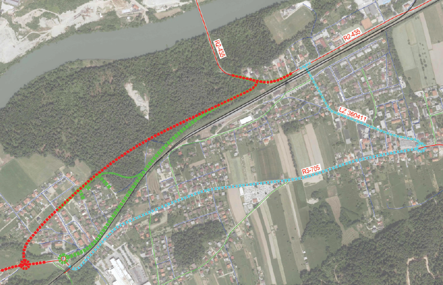
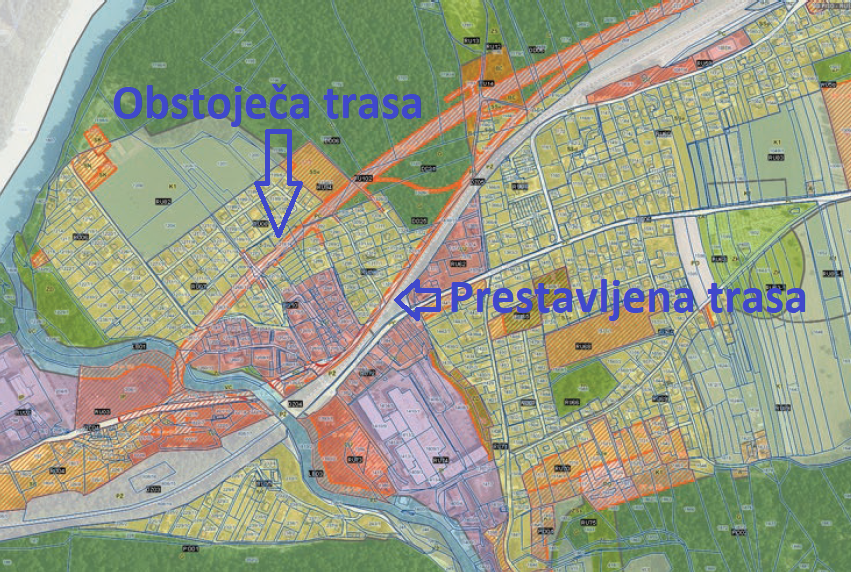
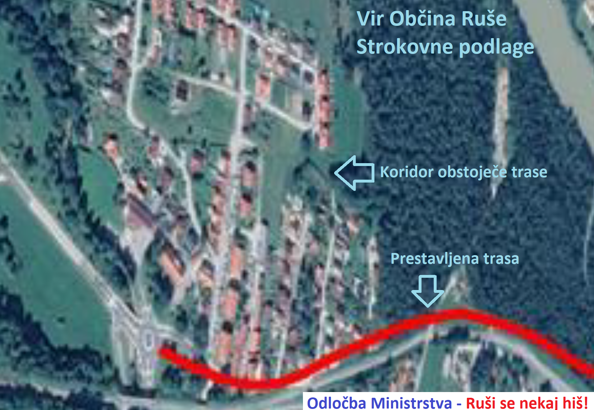
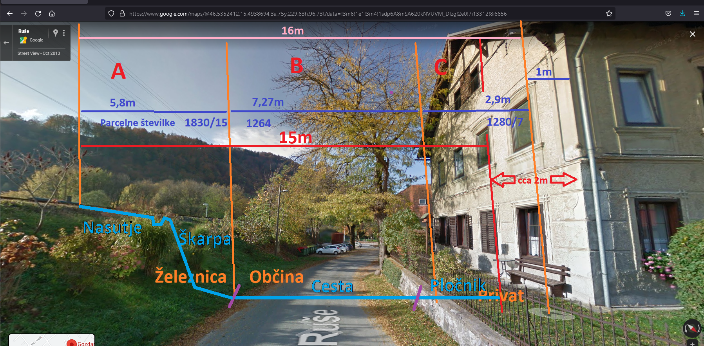
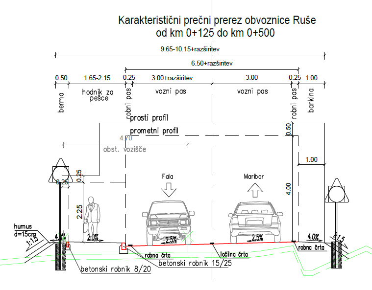
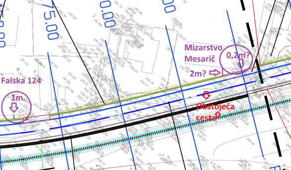
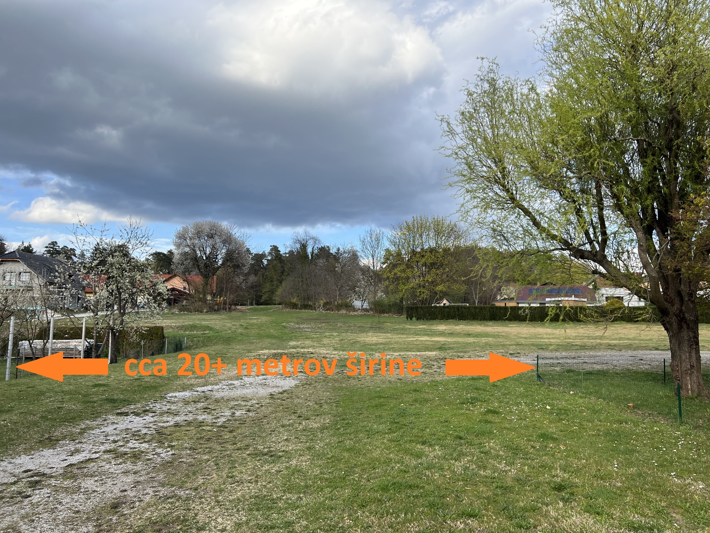

Zaskrbljeni krajani Smolnika in Ruš
 
Ad Hoc Civilna Iniciativa 

[Prva stran](index.md)

# Prvi vtis o problematiki
	
Zahodni del obvoznice Ruše je umeščen v prostor že več kot 30 let. Civilna iniciativa
sicer ni seznanjena z vsem dogajanjem glede tega dela obvoznice tekom vseh 30 let, 
vemo pa dobro (kot tudi vsi, ki živijo na tem območju) sledeče: od nekdaj se je govorilo, 
da bo na tej lokaciji cesta, ki povezuje smer iz Lovrenca na Pohorju proti ovinku 
nad mostom čez reko Dravo (Selniška cesta).

**Kot strela iz jasnega** nas je vse skupaj doletelo, da se ta 30 let stara trasa
prestavlja na drugo lokacijo. Prestavlja se na lokacijo vzdolž severnega roba železniške 
proge Maribor - Prevalje, številka 34, med železniško postajo Ruše in viaduktom na Smolniku.

Nekako nismo mogli doumeti, **kaj je narobe z našo kmečko logiko**?! 

Obstoječa trasa, je po celotni dolžini dovolj široka da se lahko izgradi **cesta z 
dvema pločnikoma, kolesarsko stezo. Dovolj je prostora za lep drevored**.

Sedaj pa Občina Ruše naenkrat premika traso ob severni rob železniške proge, na ozki
koridor med železniško progo in hiše, ki stojijo tukaj že 100 in več let (nekatere). 
Cesta je sprojektirana v **izjemno ozki širini, z ozkim hodnikom za pešce samo na eni strani**. 
Kolesarske steze ni po celotni dolžini, **namesto drevoreda pa dobimo protihrupne ograje**.

Za hiter vpogled je najbolje nekaj slikovnega materiala z opombami.

## Primerjava vseh tras 

Izsek slike iz dokumentacije Občine Ruše. Prikazuje vse tri trase, ki so relevantne v sedanji primerjavi:
- **Rdeča**:  Obstoječa trasa (30 let stara trasa)
- **Zelena**: Nova (prestavljena) trasa
- **Modra**:  Trasa po obstoječi cesti (Falska ulica + Kolodvorska ulica), za katero pa najbrž ni nihče, 
              saj gre dvakrat mimo osnovne šole Janka Glazerja Ruše.

V dokumentu se bomo osredotočili na **rdečo**, ki jo bomo poimenovali **obstoječa trasa**, in na
**zeleno**, ki jo bomo poimenovali **prestavljena trasa**.

## Primarjava dveh relevantnih tras 

Slika je izsek slike, ki je bila objavljena v uradnem glasilu Občine Ruše - Ruškem Utripu št. 1, 
marec 2022. Mi smo vrisali relevantne lokacije. Zelo lepo je vidno, da je **širina obstoječe trase**, 
ki je že vrisana v prostorske načrte skoraj 2x (**dva krat**) **širša kot nova, prestavljena trasa**, 
za katero se zavzema ga. županja Urška Repolusk. [Ruški Utrip](https://ruse.si/objava/604392).

## Koridor obstoječe trase in prestavljene trase

Na sliko smo označili koridor obstoječe trase, prestavljena trasa pa je že označena z rdečo črto. 
Slika je izsek iz slike dokumentacije Občine Ruše. **Na sliki se lepo vidi širina koridorja, ki 
ga občina že desetletja skrbno hrani za zahodni del obvoznice Ruše**. Lepo se tudi vidi, **čez koliko 
hiš je speljana rdeča črta**.

## Prestavljena trasa ob železnici

Slika območja ob **kulturno zaščiteni** večstanovanjski hiši Falska cesta 124. Na sliko smo laično 
vpisali odmike in mere iz načrta. Odmik hiše od severnega tira železniške proge smo tudi izmerili 
in znaša cca 17m do roba fasade. Varovani pas okoli železnice je 6m od osi železnice, se pravi, 
da do hiše ostane nekaj več kot 11m. Obvoznica je v tem delu široka cca. 10m. Pri tem pa v načrtih 
še niso vrisane protihrupne ograje, saj dosedaj še nismo bili deležni, da bi popravljene načrte
z vrisanimi protihrupnimi ograjami Občina Ruše naložila med dokumentacijo.

Najbrž boste iz te slike razumeli, zakaj smo to traso obvoznice poimenovali kar **“bob steza”**. 
V dokumentaciji smo zasledili, da bo cesta namenjena za kamione do 40 ton nosilnosti. Lahko si samo 
predstavljamo, kako bi tak promet vplival na to več kot 130 let staro hišo (informacija od stanovalcev). 
**Ljudem bi pa praktično pred okna postavili še protihrupne ograje**.

Za primerjavo, pas, ki je puščen na obstoječi trasi je 20 in več metrov, ob tej hiši pa je prestavljena
trasa ceste projektirana v širini cca 10 metrov.

Slika je iz platforme Google Maps.

Z **A**, **B** in **C** so označene meje parcel.

- **A**: Parcela Slovenskih železnic
- **B**: Parcela Občine Ruše
- **C**: Parcela Občine Ruše

Z modro barvo je laično prerisan potek ceste in škarpa (dograditev nasipa), ki so jo planirali 
projektanti.

## Prerez v tem delu

Prerez ceste v najožjem delu mimo Falske 126, Falske 124, Gozdarske ulice in Trpinove ulice. Niso še 
upoštevane protihrupne ograje.

## Načrt v tem delu

Načrt je izsek dokumentacije Občine Ruše. Laično smo vrisali odmike od dveh obstoječih hiš (v krogu z 
vijolično barvo) in označili sedanjo cesto z rdečo barvo. Načrt je odsek ceste od 150m do 250m od 
krožišča pri viaduktu (v istem delu kot zgornja slika).

## In kako izgleda obstoječa trasa? Sami si ustvarite svoje mnenje!

Sami si ustvarite svoje mnenje glede širine obstoječe trase.

 
 

Dokument: 

[2022-04-08-IzjavaZaJavnost.pdf](./pdf/2022-04-08-IzjavaZaJavnost.pdf)	

 
 

[Prva stran](index.md)
 
 

